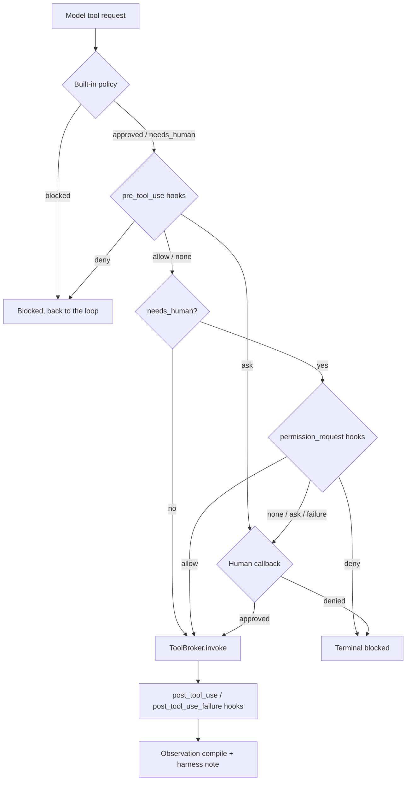

# Lifecycle Hooks Guide

How lifecycle hooks work in the current implementation, how they are wired into the
engine, and how to configure and write your own. The decisions behind this design are in
[ADR-2026-09-30: Lifecycle Hooks Engine](../decisions/2026-09-30-lifecycle-hooks-engine.md)
and [ADR-2026-09-30: Command Hooks](../decisions/2026-09-30-command-hooks.md); terms are in
the [glossary](../glossary.md).

## What a Hook Is

A [hook](../glossary.md) is a deterministic check that the agent loop runs at a fixed
lifecycle point. It receives a read-only `HookEvent` and answers with a `HookResult` (or
`None`, "no opinion"). A hook can:

- deny, allow or escalate (`ask`) a tool call;
- rewrite tool arguments before the call or tool output after it;
- add context for the model as a separate `[harness]` message;
- reject a premature `done` so the model keeps working;
- approve a `needs_human` call instead of the human.

Hooks are **not** prompts: an instruction in `AGENTS.md` or a system prompt can be ignored
by the model, a hook cannot. Hooks are **disabled by default** (`hooks.enabled: false`);
with them off the runtime behaves exactly as without the feature.

A hook is one of two types:

| `type` | Handler | Typical use |
|---|---|---|
| `python` (default) | An `async` function imported from `handler: package.module:attr` | Fast in-process checks, shipped handlers |
| `command` | An external process started from `command` — the Claude Code/Codex protocol | Hooks in any language, kept outside the package |

## Architecture

### Where Things Live

| Layer | File | Responsibility |
|---|---|---|
| Contracts | `src/contracts.py` | `HookEventName`, `HookDecision`, `HookEvent`, `HookResult`, `HookHandler` |
| Settings | `src/config.py` | `HooksSettings`, `HookSpec`, `HookMatch` (the `hooks` section) |
| Engine | `src/harness/hooks.py` | `HookEngine`, `NullHookEngine`, loading, matching, aggregation, timeouts |
| Command hooks | `src/harness/command_hooks.py` | `CommandHook`: runs a process, parses exit code and stdout |
| Generic handlers | `src/harness/builtin_hooks.py` | `approve_tools`, `grounded_final_answer` |
| Browser handlers | `src/browser/hooks.py` | `url_policy`, `prompt_injection_scan` |
| Basic command hooks | `scripts/hooks/*.py` | Ready `type: command` scripts: `sensitive_action_guard`, `secret_input_guard`, `pii_redaction`, `page_obstacle_detector`, `grounded_urls` (see [Basic Command Hooks](#basic-command-hooks)) |
| Call sites | `src/agent_loop/execution/loop.py` | Builds events, applies outcomes to `LoopState`, emits `hook.decided` |

### Ownership and Lifetime

```text
SessionContext.initialize
  -> HookEngine.from_settings(settings.hooks)      # once per session, before Chrome/MCP
  -> EngineResources.hooks                          # handed to every task
  -> AgentLoopEngine / TurnController call sites    # loop decides, engine runs handlers
```

- `HookEngine` is **session-scoped**: built in `SessionContext.initialize` before
  Chrome and MCP start, so a broken registry (import error, duplicate `id`, sync handler,
  timeout too long) fails startup instead of failing mid-task.
- It reaches the loop through `EngineResources.hooks`. Anything that builds resources
  without passing hooks — evals, tests — gets a `NullHookEngine`, so a personal
  `config.yaml` never leaks into them.
- The engine never sees `LoopState`. The loop builds a `HookEvent`, calls
  `HookEngine.run(...)`, and translates the aggregated `HookOutcome` into state updates
  itself.
- `session.json` records `hooks.enabled` and `hooks.registry_sha256` (SHA-256 of the
  registry), so a run can be matched to the hook set it used.

See the [harness boundaries diagram](../diagrams/harness-boundaries.md) and the
[agent runtime flow](../diagrams/agent-runtime-flow.md) for the whole loop with the hook
points.

### How the Engine Runs Handlers

For one event, `HookEngine.run` takes the hooks registered for that event and:

1. **Filters** by `match` (tool events only): `server` is compared exactly, `tool` is a
   regular expression matched with `re.fullmatch` (`browser_navigate|browser_tabs`).
2. **Runs them sequentially** in registry order, each under `asyncio.wait_for` with its
   timeout.
3. **Aggregates**:
   - decisions rank `deny > ask > allow > None`; the reason of the strongest decision wins;
   - the first `deny` stops the chain;
   - `updated_input` / `updated_output` **chain**: the next handler already sees the
     rewritten arguments or output;
   - `additional_context` of all handlers is concatenated.
4. **Handles failures**: a timeout, an exception or an invalid result is recorded as an
   `error`. On `goal_start` and `pre_tool_use` it counts as `deny` (fail-closed); on the
   other events it is "no decision". `fail_closed: true|false` on the spec overrides this.
5. **Reports** one `HookDecisionRecord` per handler; the loop emits it as a
   `hook.decided` event.

### Events and What the Loop Does With the Outcome

| Event | When | `deny` | `ask` | `allow` | Rewrites | Context |
|---|---|---|---|---|---|---|
| `goal_start` | Before the first model call of a task | Task ends `blocked`, no model call | — | — | — | After the user request |
| `pre_tool_use` | After built-in policy (`approved`/`needs_human`, never after `blocked`) and request normalization | Built-in block path, counts toward `policy_block_count` | Routes to `needs_human` | No effect (does **not** bypass `needs_human`) | `updated_input` (tool name may not change) | After the observation |
| `permission_request` | A call is `needs_human`, before asking the human | Terminal `blocked`, like a human refusal | Falls back to the human | Runs without asking the human | — | — |
| `post_tool_use` | After a successful tool call | — | — | — | `updated_output` replaces `content` | After the observation |
| `post_tool_use_failure` | After a failed tool call | — | — | — | `updated_output` replaces `error` | After the observation |
| `stop` | The model said `done` with status `done` | Turn becomes `continue`; the reason goes back to the model | — | — | — | Appended to the rejection |
| `goal_end` | A normal terminal result | Observational only | — | — | — | — |

Details worth knowing:

- **Only `permission_request` can stand in for the human.** A `pre_tool_use` `allow` never
  approves a `needs_human` tool, and no hook can lift a built-in `blocked`.
- **`stop`** runs only for a model `done`, never for guard terminals (turn cap,
  replan/failure limits, blocked/cancelled stops). The event carries
  `final_answer`, `evidence` (latest observation and snapshot) and `stop_hook_active`
  (`true` once a stop hook already rejected a completion in this task). After
  `hooks.max_stop_blocks` rejections (default `2`) the stop hooks are skipped — recorded as
  `skipped: stop_budget_exhausted` — and `done` is accepted.
- **`goal_end`** does not run for engine exceptions, cancellation or `GoalRunner` timeouts.
- **Context is never mixed into tool output.** `additional_context` becomes a separate
  `[harness]` user message, because snapshot fingerprints, progress detection and the
  action journal compare tool content.

Tool-call path with hooks:



### Contracts

`HookEvent` (frozen; only dicts, tuples and scalars, so it serializes to JSON):

| Field | Set on | Meaning |
|---|---|---|
| `name` | all | Event name |
| `session_id`, `goal_id`, `task_id`, `task` | all | Identity and the user's task text |
| `tool`, `server` | tool events | Exposed tool name after normalization; MCP server (`""` if not MCP) |
| `args` | tool events | A copy of the tool arguments |
| `result` | `post_tool_use*` | The `ToolResult` (`status`, `content` / `error`, …) |
| `reason` | `pre_tool_use`, `permission_request` | Reason of the built-in policy decision |
| `final_answer`, `evidence`, `stop_hook_active` | `stop` | The answer to check and what it can be checked against |
| `status` | `goal_end` | Terminal status |

`HookResult` (every field optional):

| Field | Meaning |
|---|---|
| `decision` | `"allow"`, `"deny"`, `"ask"` or `None` |
| `reason` | Shown to the model (deny/ask reason, completion rejection) |
| `updated_input` | Replacement tool arguments (`pre_tool_use`) |
| `updated_output` | Replacement tool output (`post_tool_use*`) |
| `additional_context` | Extra context for the model, as a separate message |
| `user_message` | For events/CLI only, never shown to the model |

## Configuring Hooks

Hooks are configured in the `hooks` section of the settings — normally in the git-ignored
`config.yaml` at the repository root (template: `config.example.yaml`). Environment
variables work too (`AUTOBROWSER_HOOKS__ENABLED`, `AUTOBROWSER_HOOKS__REGISTRY` as JSON),
but a registry is easier to read in YAML.

```yaml
hooks:
  enabled: true
  max_stop_blocks: 2              # stop rejections per task before done is accepted
  default_timeout_seconds: 10.0   # must stay below loop.progress_timeout_seconds (120)
  registry:
    - id: urls                                  # unique, shown in hook.decided
      event: pre_tool_use
      handler: src.browser.hooks:url_policy     # type: python is the default
      match: {tool: browser_navigate}           # tool events only
      options: {allow_domains: [ozon.ru, wildberries.ru]}
    - id: injection
      event: post_tool_use
      handler: src.browser.hooks:prompt_injection_scan
      match: {tool: browser_snapshot}
      options: {patterns: ['\bignore\s+previous\s+instructions\b']}  # factories need options
    - id: grounded
      event: stop
      handler: src.harness.builtin_hooks:grounded_final_answer
      options: {min_chars: 1}
      timeout_seconds: 5.0
    - id: audit
      event: pre_tool_use
      type: command
      command: python scripts/hooks/audit.py
      match: {server: playwright}
      fail_closed: false                        # a crash of this hook never blocks
```

`HookSpec` fields:

| Field | Required | Meaning |
|---|---|---|
| `id` | yes | Unique id |
| `event` | yes | One of the seven events |
| `type` | no | `python` (default) or `command` |
| `handler` | `python` | `package.module:attr` of an async handler, or of a factory when `options` is not empty |
| `options` | no (`python` only) | Keyword arguments for the factory; **non-empty** `options` means "call `handler(**options)` once at startup" |
| `command` | `command` | Shell command, run in the repository root |
| `match` | no (tool events only) | `{server: <exact>, tool: <fullmatch regex>}`; empty matches everything |
| `timeout_seconds` | no | Per-hook timeout; defaults to `default_timeout_seconds` |
| `fail_closed` | no | Deny on failure (`true`), never (`false`), per-event default (`null`) |

Note on factories: all shipped handlers are factories. With empty `options` the engine
uses `handler` as is and rejects it at startup ("a factory needs `options` to be called"),
so a shipped handler always needs at least one option — e.g. `options: {min_chars: 1}` for
`grounded_final_answer`. For `prompt_injection_scan` that means listing `patterns`
explicitly; its built-in defaults (`DEFAULT_INJECTION_PATTERNS`) are only reachable from
Python.

Unknown keys, a `match` on a non-tool event, a `handler` on a command hook and similar
mistakes are rejected when settings load.

## Shipped Handlers

| Handler | Event | Options | What it does |
|---|---|---|---|
| `src.harness.builtin_hooks:approve_tools` | `permission_request` | `tools`, `servers` (at least one) | Pre-approves `needs_human` calls to the listed tools or servers — for batch/eval profiles without a human |
| `src.harness.builtin_hooks:grounded_final_answer` | `stop` | `min_chars` | Rejects an empty answer or one stating numbers absent from the latest observation/snapshot (`1 299 ₽` equals `1299`; numbers from the task and list markers are ignored) |
| `src.browser.hooks:url_policy` | `pre_tool_use` + `match: {tool: browser_navigate}` | `allow_domains`, `deny_domains`, `deny_schemes` (default `file`, `chrome`, `javascript`, `data`) | Denies navigation outside the allowed domains; subdomains match. A guardrail, not a security boundary: `browser_evaluate` or a link click bypasses it |
| `src.browser.hooks:prompt_injection_scan` | `post_tool_use` + `match: {tool: browser_snapshot}` | `patterns` (English and Russian defaults) | Adds a warning that page text is untrusted data; never rewrites the snapshot |

## Writing a Python Hook

A handler is an `async` function `HookEvent -> HookResult | None` in any importable module
(the repository root is on `sys.path` when you run `main.py` from it):

```python
# myhooks/checkout.py
from src.contracts import HookEvent, HookResult


async def confirm_checkout(event: HookEvent) -> HookResult | None:
    url = str(event.args.get("url", ""))
    if "/checkout" in url:
        return HookResult(decision="ask", reason="Checkout pages need confirmation.")
    return None  # no opinion
```

```yaml
- id: checkout
  event: pre_tool_use
  handler: myhooks.checkout:confirm_checkout
  match: {tool: browser_navigate}
```

For configurable hooks write a factory and pass `options`:

```python
def block_words(words: list[str]):
    lowered = [word.lower() for word in words]

    async def handler(event: HookEvent) -> HookResult | None:
        text = str(event.args.get("text", "")).lower()
        hit = next((word for word in lowered if word in text), None)
        if hit is None:
            return None
        return HookResult(decision="deny", reason="The typed text contains a blocked word.")

    return handler
```

```yaml
- id: words
  event: pre_tool_use
  handler: myhooks.checkout:block_words
  match: {tool: browser_type}
  options: {words: [password]}
```

Rules for handlers:

- **Must be `async`** (checked at load time) so the timeout can interrupt it; do blocking
  work with `asyncio.to_thread`.
- **Never quote argument values in `reason`.** `hook.decided` is persisted and event
  redaction is key-based only — a URL with a token in its query would be stored in clear.
- **Keep `ref=` lines** if a `post_tool_use` hook rewrites a `browser_snapshot`: the
  rewritten text becomes the snapshot the model takes element refs from. Prefer
  `additional_context` over rewriting.
- Return `None` for "no opinion"; keep handlers independent of each other's order unless
  you rely on chained `updated_input`/`updated_output` on purpose.

## Writing a Command Hook

A command hook is any program. The protocol follows Claude Code and Codex:

- **Started** through the shell in the repository root, with the parent environment plus
  `AUTOBROWSER_PROJECT_DIR` (repository root) and `AUTOBROWSER_HOOK_EVENT` (event name).
- **stdin**: the `HookEvent` as one JSON object (ASCII-escaped), then EOF.
- **Answer by exit code**:

| Exit code | Meaning |
|---|---|
| `0` | Success. Empty stdout = no opinion. A JSON object on stdout = `HookResult` fields (`decision`, `reason`, `updated_input`, `updated_output`, `additional_context`, `user_message`; `"block"` is an alias of `"deny"`). Plain text = `additional_context` on `goal_start`, ignored elsewhere |
| `2` | Blocking. Stderr is the reason: `deny` on decision events; on `post_tool_use*` stderr goes to the model as `additional_context` (the tool already ran) |
| other | Hook failure: fail-closed on `goal_start`/`pre_tool_use`, no decision elsewhere (`fail_closed` overrides) |

Unknown JSON keys or wrong types count as a failure, so a typo does not pass silently. On
timeout the whole process tree is killed.

Example — `scripts/hooks/audit.py`:

```python
import json
import sys

event = json.load(sys.stdin)
url = str(event["args"].get("url", ""))

if url.startswith("http://"):
    print("Plain HTTP is not allowed; use https.", file=sys.stderr)
    sys.exit(2)                       # deny, stderr is the reason

if "/cart" in url:
    print(json.dumps({"decision": "ask", "reason": "Opening the cart needs confirmation."}))
# empty stdout + exit 0 = no opinion
```

```yaml
- id: audit
  event: pre_tool_use
  type: command
  command: python scripts/hooks/audit.py
  match: {tool: browser_navigate}
```

Differences from Claude Code:

- Input fields are ours (`name`, `tool`, `args`, …), not `tool_name`/`tool_input`, and
  the output is flat snake_case, not `hookSpecificOutput`. Claude Code scripts do not port
  as is — the tools differ anyway.
- A crash (exit code other than `0`/`2`) on `goal_start`/`pre_tool_use` **denies**; in
  Claude Code it is non-blocking. Set `fail_closed: false` to get the Claude Code behavior.
- Each run starts a process (tens of milliseconds); keep `match` narrow on frequent tools.
- The command inherits the environment, including `AUTOBROWSER_LLM__API_KEY`, and runs with
  your rights. Treat the registry like code.

## Basic Command Hooks

`scripts/hooks/` holds a ready starter set of command hooks written by the protocol
above. It follows Claude Code/Codex hooks: one self-contained script per hook, standard
library only, configured with command-line flags. Copy a script and edit it freely; nothing
in `src/` imports these files. None of them runs until it is registered.

### Enabling Them

1. Copy `config.example.yaml` to `config.yaml` (or open your existing `config.yaml`).
2. Set `hooks.enabled: true`.
3. Replace `registry: []` with the commented "Basic command hooks" block from
   `config.example.yaml`. Keep only the entries you need:

```yaml
hooks:
  enabled: true
  registry:
    - id: sensitive-actions
      event: pre_tool_use
      type: command
      command: python scripts/hooks/sensitive_action_guard.py
      match: {tool: browser_click|browser_type|browser_select_option}
    - id: secret-input
      event: pre_tool_use
      type: command
      command: python scripts/hooks/secret_input_guard.py
      match: {tool: browser_type|browser_fill_form}
    - id: pii
      event: post_tool_use
      type: command
      command: python scripts/hooks/pii_redaction.py
      match: {tool: browser_.*}
    - id: obstacles
      event: post_tool_use
      type: command
      command: python scripts/hooks/page_obstacle_detector.py
      match: {tool: browser_snapshot|browser_navigate}
    - id: grounded-urls
      event: stop
      type: command
      command: python scripts/hooks/grounded_urls.py
```

4. Check that it starts: `python main.py --no-mcp --task "inspect page"`. A broken
   registry fails startup. A broken script fails on its first event, and
   `hook.decided` records the error.

Options are flags appended to `command`, e.g.
`command: python scripts/hooks/sensitive_action_guard.py --decision deny --keyword "Отправить заявку"`.
A bad flag makes the script exit `1` (a hook failure: fail-closed on `pre_tool_use`), never
`2`, so a typo is reported as an error rather than as a silent block.

### What Each Script Does

| Script | Event / `match` | Flags | Answer |
|---|---|---|---|
| `sensitive_action_guard.py` | `pre_tool_use`, `browser_click\|browser_type\|browser_select_option` | `--decision ask\|deny` (default `ask`), `--keyword TEXT` (repeatable, replaces the Russian/English defaults: «оплатить», «оформить заказ», «удалить», `pay`, `place order`, `buy now`, `delete`…) | The `element` description matches a keyword (whole words, case/whitespace-insensitive) → JSON `{"decision": "ask"}`, or exit `2` with `--decision deny` |
| `secret_input_guard.py` | `pre_tool_use`, `browser_type\|browser_fill_form` | `--decision deny\|ask` (default `deny`), `--pattern REGEX` (repeatable) | A Luhn-valid card number (13–19 digits, contiguous or in 4-digit groups) or a pattern in any string argument except `element`/`ref` → exit `2` (or `ask`). The reason never quotes the text |
| `pii_redaction.py` | `post_tool_use` / `post_tool_use_failure`, `browser_.*` | `--kinds email,phone,card` (default all) | JSON `{"updated_output": ...}` with `[redacted <kind>]` in `content` (or `error`). Values that occur verbatim in the task are kept |
| `page_obstacle_detector.py` | `post_tool_use`, `browser_snapshot\|browser_navigate` | `--pattern REGEX` (repeatable, extends the defaults) | Captcha, «не робот», `Access denied`, `403 Forbidden`, Cloudflare `Just a moment...` → exit `2`: stderr reaches the model as a `[harness]` note, the snapshot is untouched |
| `grounded_urls.py` | `stop` | — | An `http(s)://` link in the final answer that appears neither in `evidence` nor in the task → exit `2`, the model keeps working. A link counts as seen by its full URL, its path (snapshots carry relative `/url:` values) or, for a bare site, its host |

### Things to Know

- **`ask` ends the task in the current CLI.** No human callback is wired, so a
  `needs_human` call is denied and the task finishes `blocked` ("human approval was
  denied"). Let specific tools through with a `permission_request` hook (`approve_tools`), or
  use `--decision deny` to block only the one call and let the model choose another action.
- **`python` is whatever is on `PATH`.** The scripts need only the standard library
  (Python 3.10+), so the venv and the system interpreter both work. Each event starts a
  process (tens of milliseconds), which is why every entry has a narrow `match`.
- **Output encoding.** The engine decodes stdout/stderr as UTF-8, so every script
  switches its streams to UTF-8 (`sys.stdout.reconfigure(encoding="utf-8")`); on Windows
  the default code page would garble Russian text. Keep that line in your own scripts.
- **The guards read Playwright MCP argument names** (`element`, `text`, `fields`). With
  another browser server, adjust `match` or the script.
- **`pii_redaction.py` changes what the model sees.** Masking is deterministic, so
  snapshot fingerprints and progress detection stay stable, and refs (`e123`) never match.
  A task that must *read* an e-mail or phone number off a page needs `--kinds` without that
  kind. Phones are Russian-style (`+7`/`8`, then 3-3-2-2 digits).
- **`grounded_urls.py` shares `hooks.max_stop_blocks`** with the other stop hooks. A link
  seen several pages ago but not on the latest page is rejected too; once the budget is
  spent, `done` is accepted.
- `sensitive_action_guard.py` is a guardrail, not a security boundary: `browser_press_key`
  (`Enter` in a form) and `browser_evaluate` carry no `element` description.

Tests: `tests/test_hook_scripts.py` runs every script as a real process and loads the
registry block from `config.example.yaml`. If you change a script or that block, run it.

## Managing Hooks: Common Operations

Two facts shape every operation below:

- **The registry is read once per session**, in `SessionContext.initialize`. Any change to
  `config.yaml` (or to a handler's code) takes effect after restarting `main.py`; a
  running REPL keeps the hooks it started with.
- **The YAML file outranks the environment** (init kwargs > YAML > env > `.env`). If
  `config.yaml` sets a hook field, `AUTOBROWSER_HOOKS__*` cannot override it — edit the
  file or switch profiles instead.

### Check the Registry Without Starting the Browser

Loads the settings exactly as the session does and prints the hooks per event; a broken
registry raises `HookConfigError` or a validation error naming the hook:

```powershell
python -c "from src.config import get_settings; from src.harness.hooks import HookEngine; s = get_settings(); e = HookEngine.from_settings(s.hooks, progress_timeout_seconds=s.loop.progress_timeout_seconds); print(type(e).__name__, {k: [h.id for h in v] for k, v in getattr(e, '_hooks', {}).items()})"
```

`NullHookEngine {}` means hooks are disabled.

### Enable Hooks for the First Time

1. Copy the `hooks` section from `config.example.yaml` into `config.yaml` at the
   repository root (create the file if it does not exist — it is git-ignored).
2. Set `enabled: true` and add at least one `registry` entry.
3. Run the registry check above, then restart `main.py`.
4. Confirm in `.autobrowser/sessions/<session_id>/session.json` that `hooks.enabled` is
   `true`.

### Create a Hook

1. Pick the event from the [events table](#events-and-what-the-loop-does-with-the-outcome)
   and the narrowest `match` (tool events only).
2. Choose the type:
   - a shipped handler — reference it with `handler` and set its `options`;
   - your own Python hook — write an `async` handler or factory in an importable module
     (see [Writing a Python Hook](#writing-a-python-hook));
   - your own command — write the script (see
     [Writing a Command Hook](#writing-a-command-hook)) and test it by hand first:
     `'{"name":"pre_tool_use","args":{"url":"http://x.test"}}' | python scripts/hooks/audit.py; $LASTEXITCODE`.
3. Add a `registry` entry with a new unique `id`. Its position matters: hooks of one
   event run top to bottom, and the first `deny` stops the rest.
4. Add a unit test that builds `HookEngine` from explicit settings (see
   [Testing Hooks](#testing-hooks)).
5. Check the registry, restart, and watch `hook.decided` in `events.jsonl`.

### Change a Hook

| Change | How |
|---|---|
| Handler behavior | Edit the handler code or script, restart. A command script is re-run on every event, so its code changes apply after the restart too |
| Options, timeout, `fail_closed`, `match` | Edit the fields of the entry; `timeout_seconds` must stay below `loop.progress_timeout_seconds` |
| Which event it runs on | Change `event`; drop `match` if the new event is not a tool event |
| Order | Move the entry in the list — it matters for `deny` short-circuit and chained `updated_input`/`updated_output` |
| Python → command (or back) | Set `type: command` and `command`, and remove `handler`/`options` (or the reverse); the two sets of fields are mutually exclusive |
| Rename | Change `id`; update anything that filters `hook.decided` by `hook_id` |

Every change alters `hooks.registry_sha256` in `session.json`, so runs before and after
the change can be told apart.

### Disable or Remove a Hook

- **One hook**: there is no per-hook `enabled` flag — comment the entry out (`#`) or
  delete it from `registry`.
- **All hooks, keeping the registry**: set `hooks.enabled: false` in `config.yaml`.
  `AUTOBROWSER_HOOKS__ENABLED=false` works only if the YAML file does not set `enabled`.
- **All hooks for one run**: point `AUTOBROWSER_CONFIG_FILE` at a profile without hooks
  (see below).
- **Removing a handler's code**: first remove every registry entry that names it,
  otherwise the next start fails with `cannot import`.

### Use Different Hook Sets (Profiles)

`AUTOBROWSER_CONFIG_FILE` replaces the default `config.yaml` with another file (a missing
file fails startup). Keep one profile per purpose, e.g. `config.local.yaml` (git-ignored)
for experiments or a batch profile with `approve_tools`:

```powershell
$env:AUTOBROWSER_CONFIG_FILE = "config.local.yaml"
python main.py
Remove-Item Env:AUTOBROWSER_CONFIG_FILE   # back to config.yaml
```

### Add a Shipped Handler to the Project

To ship a new built-in handler with AutoBrowser rather than keep it in a personal module:

1. Put it in `src/harness/builtin_hooks.py` if it is server-neutral, or in
   `src/browser/hooks.py` if it knows about browser tools. Follow the existing shape: a
   factory that validates its options and returns an `async` handler, listed in `__all__`.
2. Cover it in `tests/test_builtin_hooks.py` or `tests/test_browser_hooks.py`.
3. Document it in the [Shipped Handlers](#shipped-handlers) table and, if it is a useful
   default, as a commented example in `config.example.yaml`.

## Observing and Debugging

- Every handler run emits `hook.decided` to `.autobrowser/sessions/<session_id>/events.jsonl`
  with `hook_id`, `event`, `tool`, `server`, `decision`, `reason`, `modified`,
  `duration_ms`, `error` (`"timeout"` or `"<ExcType>: message"`) and `skipped`. Arguments
  and results are never included.
- `python scripts/replay_trace.py .autobrowser\sessions\<session_id>\events.jsonl` replays a
  run, hooks included.
- `session.json` shows whether hooks were enabled and the registry SHA-256.
- A registry error fails at startup with `HookConfigError` naming the hook `id`.
- Timeouts must stay below `loop.progress_timeout_seconds`; otherwise loading fails,
  because a slow hook would trip the `GoalRunner` watchdog.

## Testing Hooks

Never read hooks from `get_settings()` in tests — the personal `config.yaml` would leak in.
Build the engine from explicit settings and run it on a hand-made event:

```python
import pytest

from src.config import HooksSettings
from src.contracts import HookEvent
from src.harness.hooks import HookEngine


@pytest.mark.asyncio
async def test_checkout_asks() -> None:
    engine = HookEngine.from_settings(
        HooksSettings(
            enabled=True,
            registry=[
                {
                    "id": "checkout",
                    "event": "pre_tool_use",
                    "handler": "myhooks.checkout:confirm_checkout",
                },
            ],
        ),
        progress_timeout_seconds=120.0,
    )
    event = HookEvent(
        name="pre_tool_use",
        session_id="s",
        goal_id="t",
        task_id="t",
        task="buy a jacket",
        tool="browser_navigate",
        args={"url": "https://shop.test/checkout"},
    )

    outcome = await engine.run(event)

    assert outcome.decision == "ask"
```

Existing suites to run after changing hook code:

```powershell
python -m pytest tests\test_harness_hooks.py tests\test_agent_loop_hooks.py tests\test_browser_hooks.py tests\test_builtin_hooks.py tests\test_command_hooks.py tests\test_hook_scripts.py
```

## Related

- [Glossary](../glossary.md)
- [ADR-2026-09-30: Lifecycle Hooks Engine](../decisions/2026-09-30-lifecycle-hooks-engine.md)
- [ADR-2026-09-30: Command Hooks](../decisions/2026-09-30-command-hooks.md)
- [Lifecycle hooks research](../research/2026-09-30-lifecycle-hooks-research.md)
- [Lifecycle hooks implementation plan](2026-09-30-lifecycle-hooks-implementation-plan.md)
- [Agent runtime flow](../diagrams/agent-runtime-flow.md)
- [Harness boundaries](../diagrams/harness-boundaries.md)
