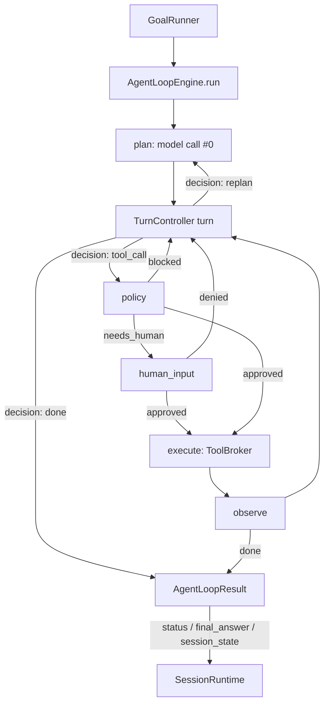

# Agent Runtime Flow

This diagram shows the engine-native control flow owned by `AgentLoopEngine`
(`src/agent_loop/execution/loop.py`), driven through `TurnController` for one
goal run. There is no compiled graph.

`AgentLoopEngine` builds the initial plan, then runs a bounded `while` loop of
`TurnController` turns. A turn applies policy before execution, observes the tool
result, and either continues, replans, or reaches a terminal status that becomes
the `AgentLoopResult` (`status` is always `done`/`blocked`/`cancelled`).
`GoalRunner` keeps the one-task lifecycle (timeouts, watchdog, goal events)
outside the engine; `SessionRuntime` injects carried state and persists the
result's `session_state` between tasks.
