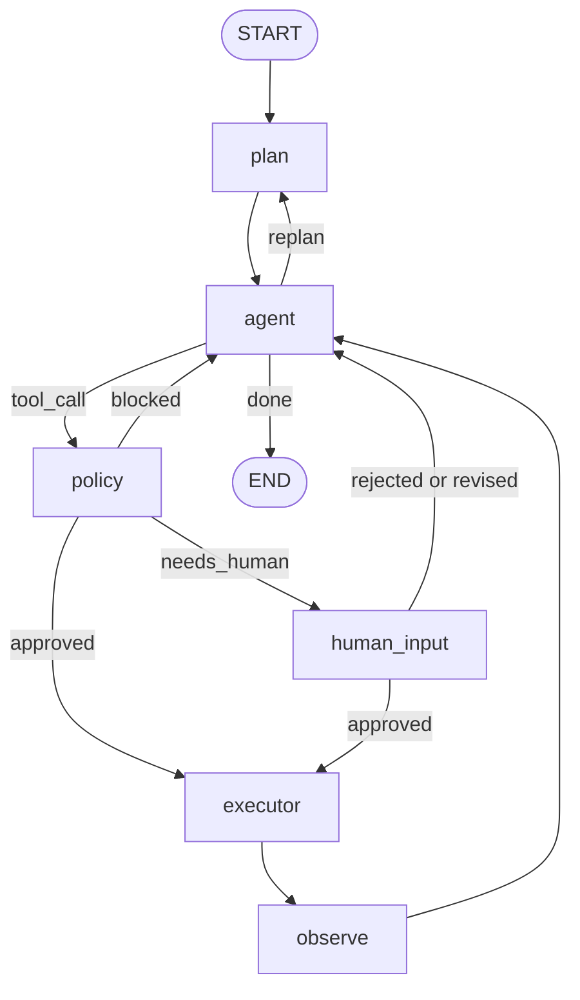

# Agent Runtime Flow

This diagram shows the verified LangGraph node flow assembled by
`build_agent_graph`.

The graph keeps planning, reasoning, policy, execution, and observation as
separate responsibilities. Runtime infrastructure is injected by the harness
when the graph is compiled.
