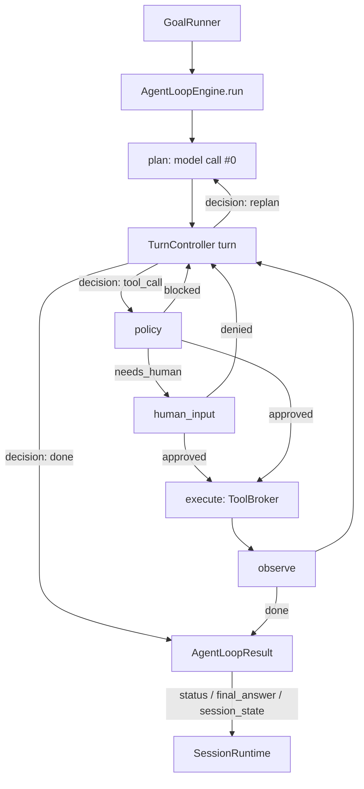

# Agent Runtime Flow

This diagram shows the engine-native control flow owned by `AgentLoopEngine`
(`src/agent_loop/execution/loop.py`), driven through `TurnController` for one
goal run. There is no compiled graph.

```mermaid
flowchart TD
  GoalRunner[GoalRunner] --> Engine[AgentLoopEngine.run]
  Engine --> Plan[plan: model call #0]
  Plan --> Turn[TurnController turn]
  Turn -->|decision: tool_call| Policy[policy]
  Turn -->|decision: replan| Plan
  Turn -->|decision: done| Result[AgentLoopResult]
  Policy -->|blocked| Turn
  Policy -->|needs_human| Human[human_input]
  Human -->|denied| Turn
  Human -->|approved| Exec[execute: ToolBroker]
  Policy -->|approved| Exec
  Exec --> Obs[observe]
  Obs --> Turn
  Obs -->|done| Result
  Result -->|status / final_answer / session_state| Session[SessionRuntime]
```

`AgentLoopEngine` builds the initial plan, then runs a bounded `while` loop of
`TurnController` turns. A turn applies policy before execution, observes the tool
result, and either continues, replans, or reaches a terminal status that becomes
the `AgentLoopResult` (`status` is always `done`/`blocked`/`cancelled`).
`GoalRunner` keeps the one-task lifecycle (timeouts, watchdog, goal events)
outside the engine; `SessionRuntime` injects carried state and persists the
result's `session_state` between tasks.

Progress tracking is server-neutral. `observe` appends every executed call to the
task-local action journal (`LoopState.action_history`, `execution/progress.py`),
keyed by tool + arguments and by result, and adds a repeat note when a call
reproduces an earlier identical outcome. The turn prompt renders the journal as
the `Action History` block. `policy` returns `blocked` for a call that already
returned the identical result `settings.loop.max_ineffective_actions` times. The
terminal status is read from the explicit `LoopState.completion_status` set by
whoever ended the run, so loop-protection stops and model `blocked`/`failed`
stops end as `blocked`, never as `done`.
