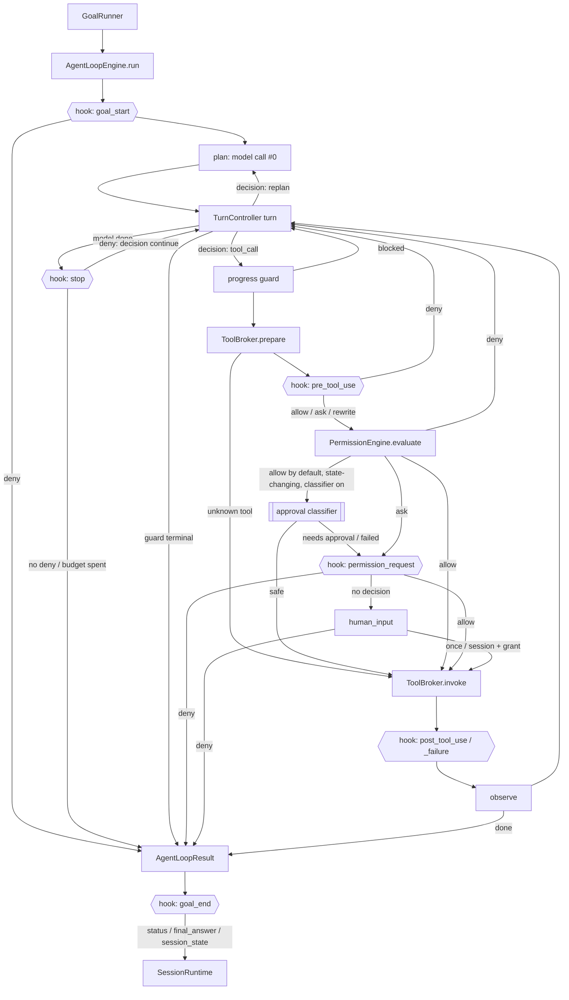

# Agent Runtime Flow

This diagram shows the engine-native control flow owned by `AgentLoopEngine`
(`src/agent_loop/execution/loop.py`), driven through `TurnController` for one
goal run. There is no compiled graph.

```mermaid
flowchart TD
  GoalRunner[GoalRunner] --> Engine[AgentLoopEngine.run]
  Engine --> GoalStart{{"hook: goal_start"}}
  GoalStart -->|deny| Result
  GoalStart --> Plan[plan: model call #0]
  Plan --> Turn[TurnController turn]
  Turn -->|decision: tool_call| Progress[progress guard]
  Turn -->|decision: replan| Plan
  Turn -->|model done| Stop{{"hook: stop"}}
  Stop -->|deny: decision continue| Turn
  Stop -->|no deny / budget spent| Result[AgentLoopResult]
  Turn -->|guard terminal| Result
  Progress -->|blocked| Turn
  Progress --> Prepare[ToolBroker.prepare]
  Prepare -->|unknown tool| Exec
  Prepare --> Pre{{"hook: pre_tool_use"}}
  Pre -->|deny| Turn
  Pre -->|allow / ask / rewrite| Permissions[PermissionEngine.evaluate]
  Permissions -->|deny| Turn
  Permissions -->|allow by default, state-changing, classifier on| Classifier[[approval classifier]]
  Classifier -->|safe| Exec
  Classifier -->|needs approval / failed| Perm
  Permissions -->|allow| Exec
  Permissions -->|ask| Perm{{"hook: permission_request"}}
  Perm -->|allow| Exec
  Perm -->|deny| Result
  Perm -->|no decision| Human[human_input]
  Human -->|deny| Result
  Human -->|once / session + grant| Exec[ToolBroker.invoke]
  Exec --> Post{{"hook: post_tool_use / _failure"}}
  Post --> Obs[observe]
  Obs --> Turn
  Obs -->|done| Result
  Result --> GoalEnd{{"hook: goal_end"}}
  GoalEnd -->|status / final_answer / session_state| Session[SessionRuntime]
```

`AgentLoopEngine` builds the initial plan, then runs a bounded `while` loop of
`TurnController` turns. A turn checks progress and permissions before execution, observes the tool
result, and either continues, replans, or reaches a terminal status that becomes
the `AgentLoopResult` (`status` is always `done`/`blocked`/`cancelled`).
`GoalRunner` keeps the one-task lifecycle (timeouts, watchdog, goal events)
outside the engine; `SessionRuntime` injects carried state and persists the
result's `session_state` between tasks.

Progress tracking is server-neutral. `observe` appends every executed call to the
task-local action journal (`LoopState.action_history`, `execution/progress.py`),
keyed by tool + arguments and by result, and adds a repeat note when a call
reproduces an earlier identical outcome. The turn prompt renders the journal as
the `Action History` block. The progress guard (`guards.progress_block_reason`, event
`policy.decided`) skips a call that already returned the identical result
`settings.loop.max_ineffective_actions` times; the model reads the reason as the tool output. The
terminal status is read from the explicit `LoopState.completion_status` set by
whoever ended the run, so loop-protection stops and model `blocked`/`failed`
stops end as `blocked`, never as `done`.

Lifecycle hooks (`src/harness/hooks.py`, see the
[ADR](../decisions/2026-09-30-lifecycle-hooks-engine.md)) sit at the hexagon points and
are skipped entirely when hooks are disabled. `pre_tool_use` runs after the progress
guard and never after its `blocked`. `post_tool_use` may rewrite the
output before `observe`; hook context becomes a separate `[harness]` message after it.
`stop` runs only for a model `done` with status `done` (never for guard terminals); a
deny turns the turn into `decision: "continue"`, bounded by `hooks.max_stop_blocks` and
the turn cap. Every handler run emits one `hook.decided` event.

Authorization is the session's `PermissionEngine` (`src/harness/permissions.py`, see the
[ADR](../decisions/2026-10-01-permission-engine.md)), evaluated **after** `pre_tool_use` on
the final arguments and emitted as `permission.decided`. Rules resolve `deny > ask > allow`;
a hook `allow` cannot lift a rule, a hook `ask` is escalated through the same mode logic. A
permission `deny` is not terminal: the model reads the reason and may take another path. An
`ask` emits `approval.requested`; `permission_request` hooks may stand in for the human, and
the human answers `once`, `session` (stores a `(server, tool, domain)` grant) or `deny`
(terminal `blocked`). Every resolved approval emits `approval.resolved`.
With `permissions.approval_judge` on
([ADR](../decisions/2026-10-02-model-approval-judge.md)), the model's own `approval_request`
argument (stripped when the call is parsed) and the approval classifier can turn a default
`allow` into an `always_ask`; neither can lift a rule.
