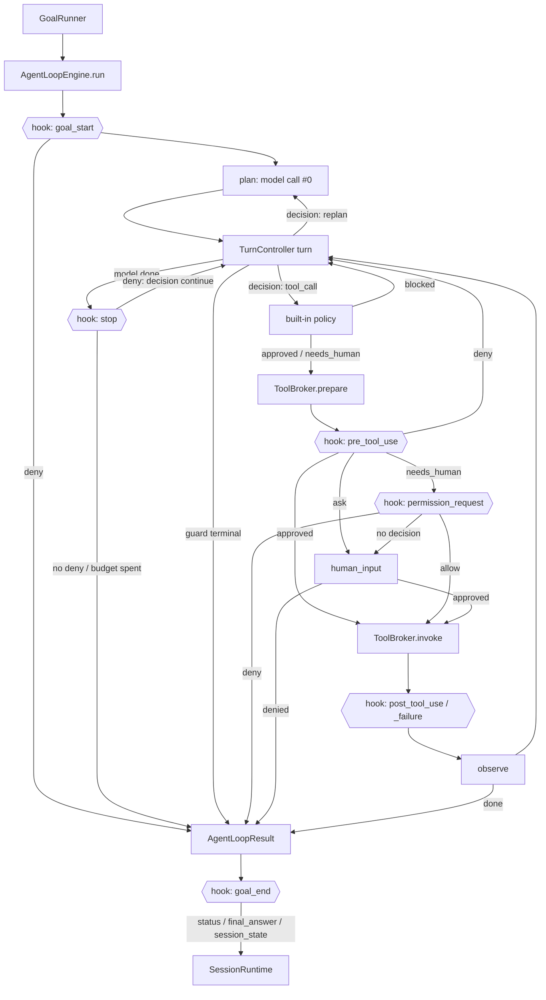

# Agent Runtime Flow

This diagram shows the engine-native control flow owned by `AgentLoopEngine`
(`src/agent_loop/execution/loop.py`), driven through `TurnController` for one
goal run. There is no compiled graph.

```mermaid
flowchart TD
  GoalRunner[GoalRunner] --> Engine[AgentLoopEngine.run]
  Engine --> GoalStart{{"hook: goal_start"}}
  GoalStart -->|deny| Result
  GoalStart --> Plan[plan: model call #0]
  Plan --> Turn[TurnController turn]
  Turn -->|decision: tool_call| Policy[built-in policy]
  Turn -->|decision: replan| Plan
  Turn -->|model done| Stop{{"hook: stop"}}
  Stop -->|deny: decision continue| Turn
  Stop -->|no deny / budget spent| Result[AgentLoopResult]
  Turn -->|guard terminal| Result
  Policy -->|blocked| Turn
  Policy -->|approved / needs_human| Prepare[ToolBroker.prepare]
  Prepare --> Pre{{"hook: pre_tool_use"}}
  Pre -->|deny| Turn
  Pre -->|ask| Human
  Pre -->|approved| Exec
  Pre -->|needs_human| Perm{{"hook: permission_request"}}
  Perm -->|allow| Exec
  Perm -->|deny| Result
  Perm -->|no decision| Human[human_input]
  Human -->|denied| Result
  Human -->|approved| Exec[ToolBroker.invoke]
  Exec --> Post{{"hook: post_tool_use / _failure"}}
  Post --> Obs[observe]
  Obs --> Turn
  Obs -->|done| Result
  Result --> GoalEnd{{"hook: goal_end"}}
  GoalEnd -->|status / final_answer / session_state| Session[SessionRuntime]
```

`AgentLoopEngine` builds the initial plan, then runs a bounded `while` loop of
`TurnController` turns. A turn applies policy before execution, observes the tool
result, and either continues, replans, or reaches a terminal status that becomes
the `AgentLoopResult` (`status` is always `done`/`blocked`/`cancelled`).
`GoalRunner` keeps the one-task lifecycle (timeouts, watchdog, goal events)
outside the engine; `SessionRuntime` injects carried state and persists the
result's `session_state` between tasks.

Progress tracking is server-neutral. `observe` appends every executed call to the
task-local action journal (`LoopState.action_history`, `execution/progress.py`),
keyed by tool + arguments and by result, and adds a repeat note when a call
reproduces an earlier identical outcome. The turn prompt renders the journal as
the `Action History` block. `policy` returns `blocked` for a call that already
returned the identical result `settings.loop.max_ineffective_actions` times. The
terminal status is read from the explicit `LoopState.completion_status` set by
whoever ended the run, so loop-protection stops and model `blocked`/`failed`
stops end as `blocked`, never as `done`.

Lifecycle hooks (`src/harness/hooks.py`, see the
[ADR](../decisions/2026-09-30-lifecycle-hooks-engine.md)) sit at the hexagon points and
are skipped entirely when hooks are disabled. `pre_tool_use` runs after built-in policy
and never after a built-in `blocked`; its `allow` does not lift `needs_human` — only
`permission_request` can approve instead of the human. `post_tool_use` may rewrite the
output before `observe`; hook context becomes a separate `[harness]` message after it.
`stop` runs only for a model `done` with status `done` (never for guard terminals); a
deny turns the turn into `decision: "continue"`, bounded by `hooks.max_stop_blocks` and
the turn cap. Every handler run emits one `hook.decided` event.
