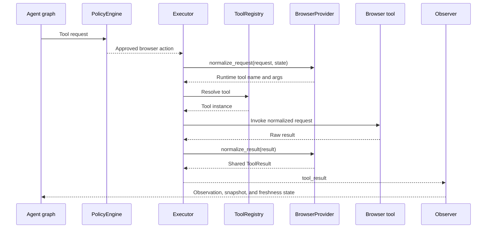

# Browser Provider Boundary

This diagram shows how browser-specific adaptation is isolated behind
`BrowserProvider` implementations while the agent graph and executor keep using
the shared tool registry and state contracts.

Production browser tools are wrapped by `PlaywrightMCPBrowserProvider`.
Deterministic tests can use `FakeBrowserProvider` without Chrome, CDP, or MCP.
