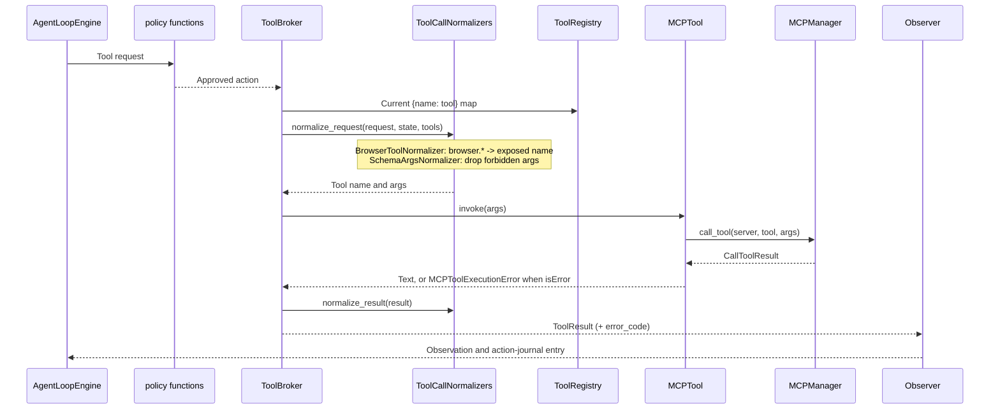

# Tool Call Normalization

This diagram shows how `ToolBroker` folds every tool call through stateless
`ToolCallNormalizer`s before and after invoking an MCP-backed tool. It replaces the former
`BrowserProvider` boundary (see
[ADR-2026-09-28: Universal MCP Manager](../decisions/2026-09-28-universal-mcp-manager.md)).

```mermaid
sequenceDiagram
  participant Agent as AgentLoopEngine
  participant Policy as policy functions
  participant Broker as ToolBroker
  participant Norm as ToolCallNormalizers
  participant Registry as ToolRegistry
  participant Tool as MCPTool
  participant Manager as MCPManager
  participant Observer

  Agent->>Policy: Tool request
  Policy-->>Broker: Approved action
  Broker->>Registry: Current {name: tool} map
  Broker->>Norm: normalize_request(request, state, tools)
  Note over Norm: BrowserToolNormalizer: browser.* -> exposed name<br/>SchemaArgsNormalizer: drop forbidden args
  Norm-->>Broker: Tool name and args
  Broker->>Tool: invoke(args)
  Tool->>Manager: call_tool(server, tool, args)
  Manager-->>Tool: CallToolResult
  Tool-->>Broker: Text, or MCPToolExecutionError when isError
  Broker->>Norm: normalize_result(result)
  Broker-->>Observer: ToolResult (+ error_code)
  Observer-->>Agent: Observation and action-journal entry
```

Normalizers hold no tools and do no ref rewriting or snapshot lookups. Deterministic tests use
`tests/mcp_fixtures/fake_server.py` (a real MCP server) or `FakeBrowserProvider` without
Chrome or CDP.
