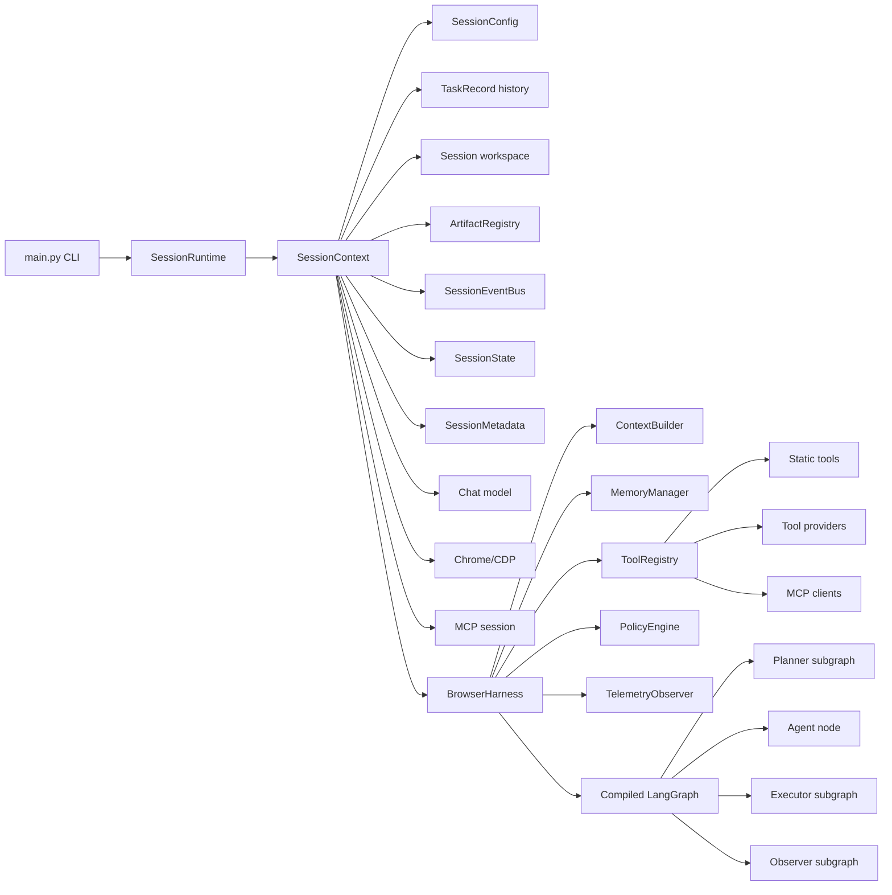

# Harness Boundaries

This diagram shows how `SessionRuntime` coordinates lifecycle through
`SessionContext`, while `BrowserHarness` composes runtime infrastructure around
one task execution.

The boundary is intentional: `SessionRuntime` coordinates interaction
lifecycle, `SessionContext` owns session-scoped state and resources,
`BrowserHarness` injects graph runtime dependencies, and the agent graph owns
reasoning and state transitions.
