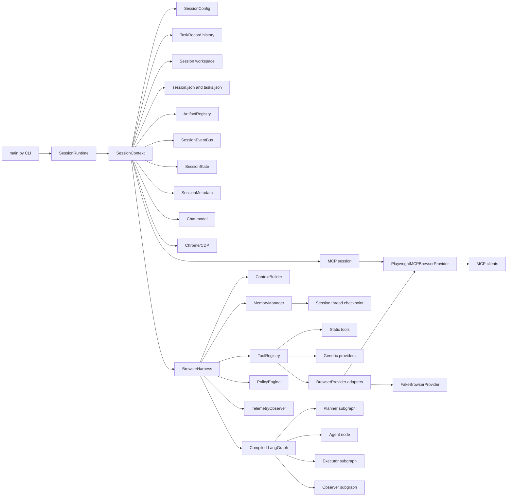

# Harness Boundaries

This diagram shows how `SessionRuntime` coordinates lifecycle through
`SessionContext`, while `BrowserHarness` composes runtime infrastructure around
task execution inside a session-scoped graph thread.

The boundary is intentional: `SessionRuntime` coordinates interaction
lifecycle, `SessionContext` owns session-scoped state and resources,
`BrowserHarness` injects graph runtime dependencies, and the agent graph owns
reasoning and state transitions. Graph checkpoints are scoped to the active
session thread. Browser-specific schema adaptation is owned by
`BrowserProvider` adapters registered in `ToolRegistry`, not by the agent loop.
`SessionRuntime` carries useful state between tasks through
`SessionContext.state` and resets task-local graph fields before the next
invocation, while session metadata remains available in `.autobrowser`.
