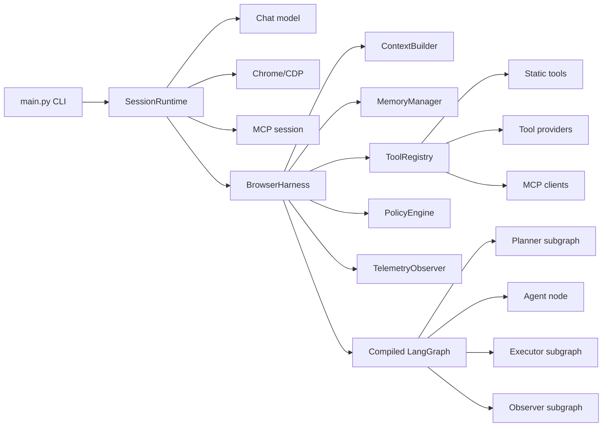

# Harness Boundaries

This diagram shows how `SessionRuntime` owns process-lifetime resources and
uses `BrowserHarness` to compose runtime infrastructure around one task
execution.

The boundary is intentional: `SessionRuntime` owns interaction lifecycle and
long-lived resources, `BrowserHarness` injects per-task runtime dependencies,
and the agent graph owns reasoning and state transitions.
