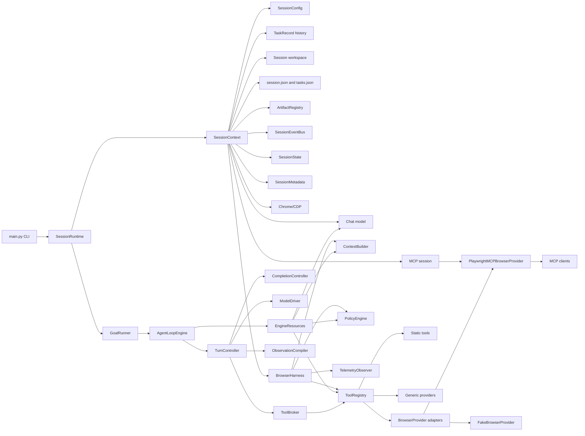

# Harness Boundaries

This diagram shows how `SessionRuntime` coordinates lifecycle through
`SessionContext`, while `BrowserHarness` is the composition root whose
collaborators `EngineResources.from_harness` bundles for the engine-native
`AgentLoopEngine`.

The boundary is intentional: `SessionRuntime` coordinates interaction lifecycle,
`SessionContext` owns session-scoped state and resources, `BrowserHarness` is a
pure composition root (no graph), and `AgentLoopEngine` owns reasoning and state
transitions over a frozen `LoopState`. Browser-specific schema adaptation is
owned by `BrowserProvider` adapters registered in `ToolRegistry`, not by the
engine. Conversation history is not a harness or `EngineResources` resource:
`src/harness/memory.py` provides functional message-shaping helpers the engine
calls, and the durable `list[Message]` is carried on `LoopState.messages` /
`SessionContext.state`. `SessionRuntime` carries useful state between tasks
through `SessionContext.state` and resets task-local fields before the next run,
while session metadata remains available in `.autobrowser`.
