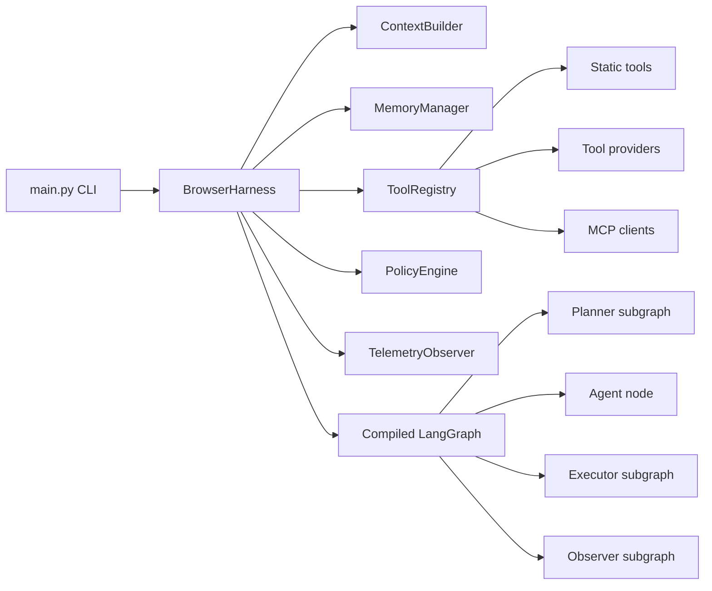

# Harness Boundaries

This diagram shows how `BrowserHarness` composes runtime infrastructure around
the LangGraph agent loop.

The boundary is intentional: browser-specific clients and toolsets should be
registered through `ToolRegistry` or injected through `BrowserHarness`, while
the agent graph owns reasoning and state transitions.
