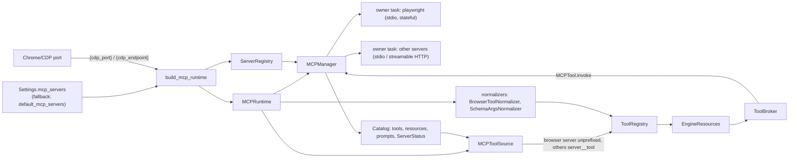
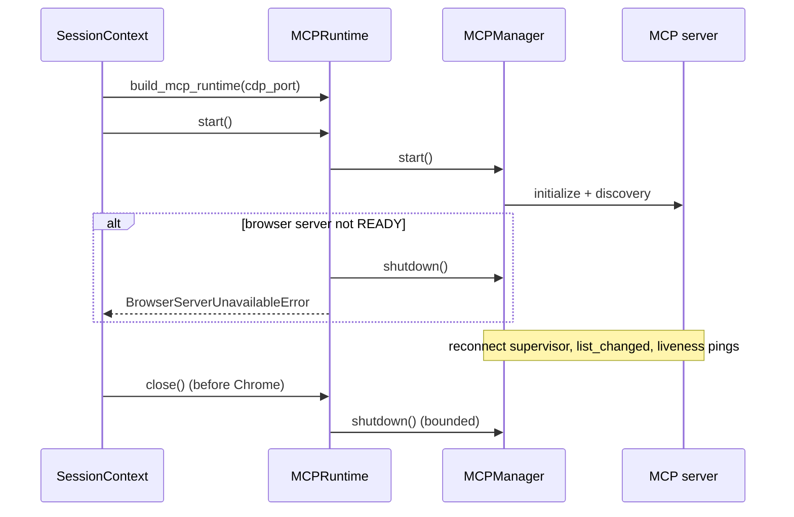

# MCP Runtime

How the session builds, starts and shuts down the universal `MCPManager`, and how MCP tools
reach the engine. See [ADR-2026-09-28: Universal MCP Manager](../decisions/2026-09-28-universal-mcp-manager.md)
and the [glossary](../glossary.md).

