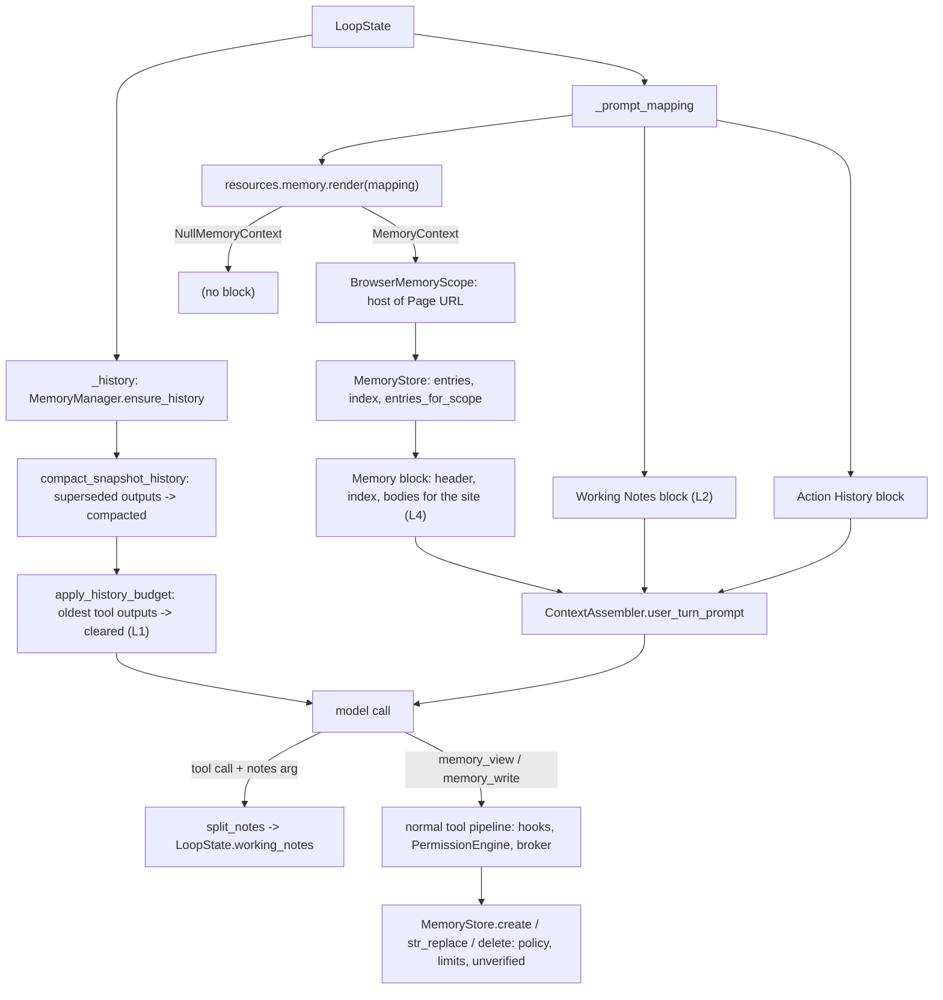
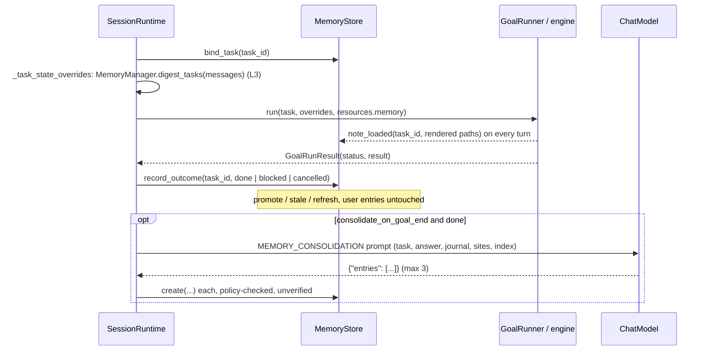

# Memory Layers

Where each memory layer acts: on every history build and turn prompt (L1, L2, L4 read), at the
task boundary (L3) and after `goal_end` (staged trust, consolidation). See the
[Memory guide](../development/memory.md) and
[ADR-2026-10-02: Layered Agent Memory](../decisions/2026-10-02-layered-agent-memory.md).

## Context Assembly (Every Turn)

## Task Boundary and Goal End

