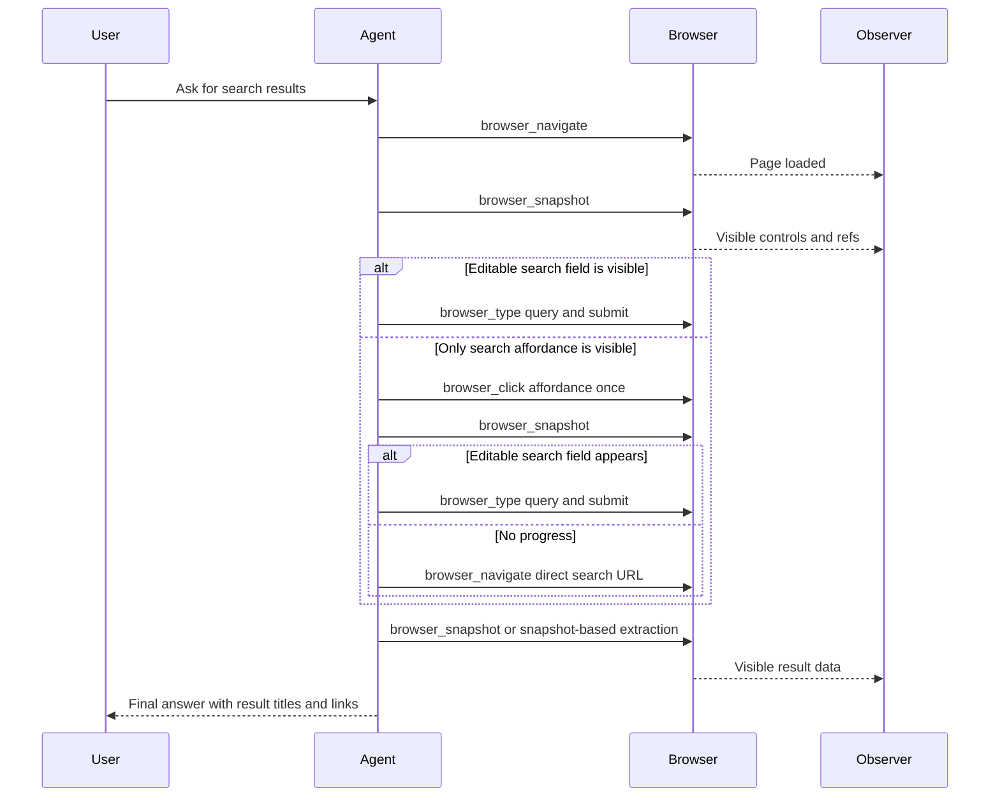

# Search Task Sequence

This diagram shows the intended high-level tool sequence for browser search
tasks. It documents the expected behavior after the prompt changes that limit
repeated Search-button loops.

The agent should not repeat the same Search-button click after an unchanged
snapshot. Direct search URL navigation is the preferred fallback for sites with
a known query URL pattern.
