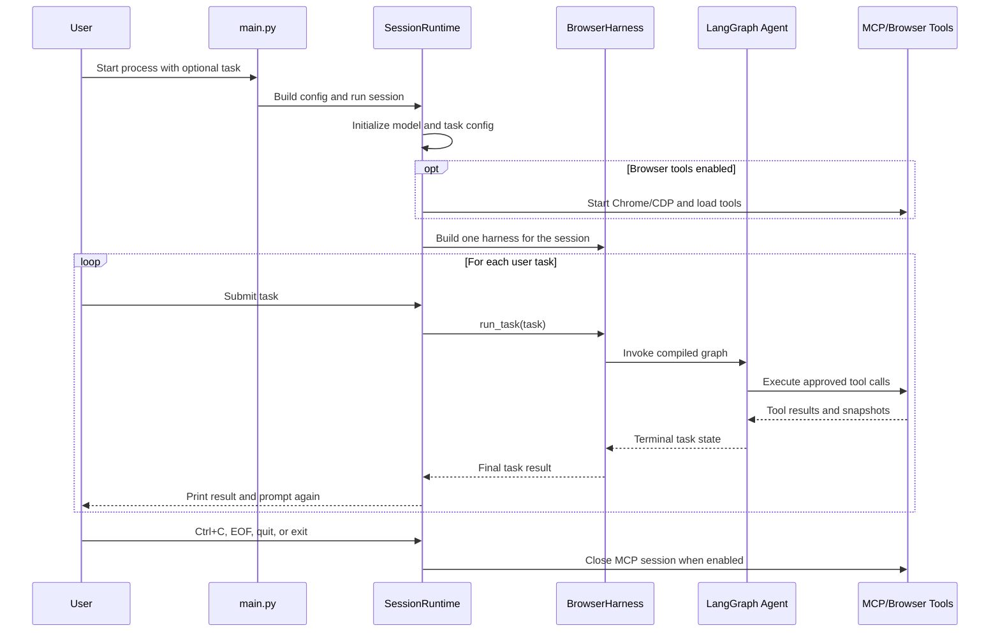

# Session Runtime Sequence

This diagram shows the long-lived CLI session lifecycle. A terminal agent state
ends the current task only; the session keeps waiting for another user request
until the process is interrupted or an exit command is entered.

