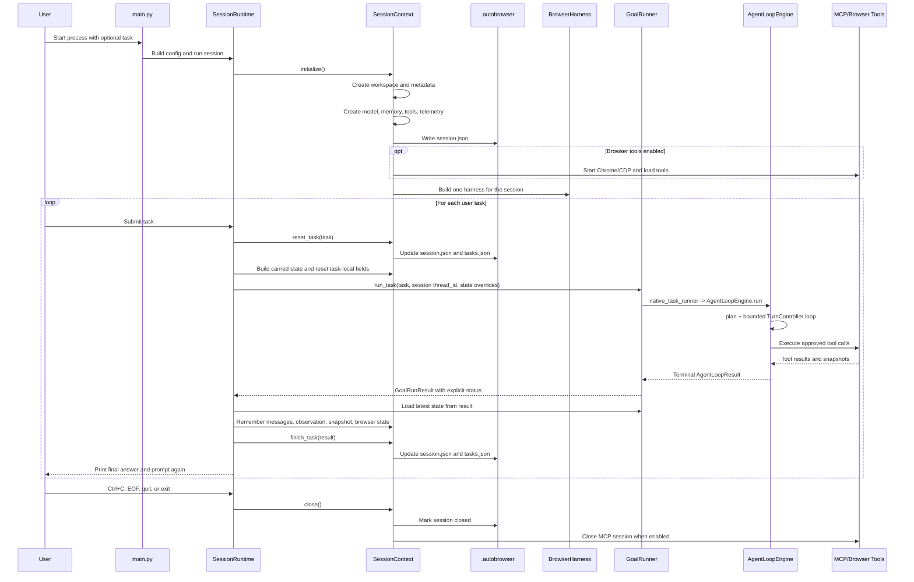

# Session Runtime Sequence

This diagram shows the long-lived CLI session lifecycle. A terminal
`AgentLoopResult` ends the current task only; the session keeps waiting for
another user request until the process is interrupted or an exit command is
entered. Useful agent context is carried across tasks through the terminal
result's `session_state` and `SessionContext.state`.

