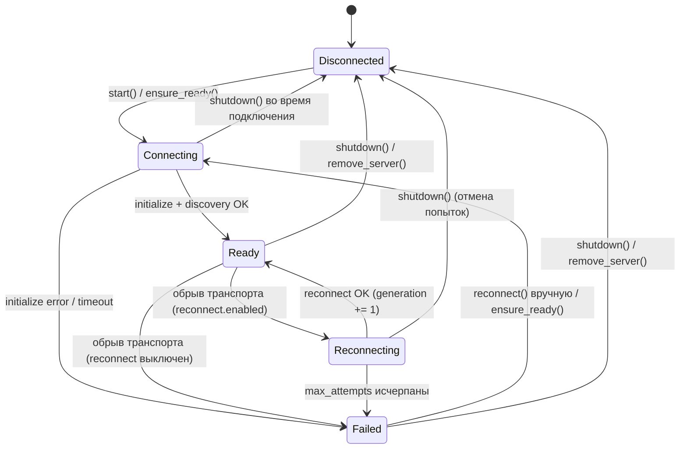
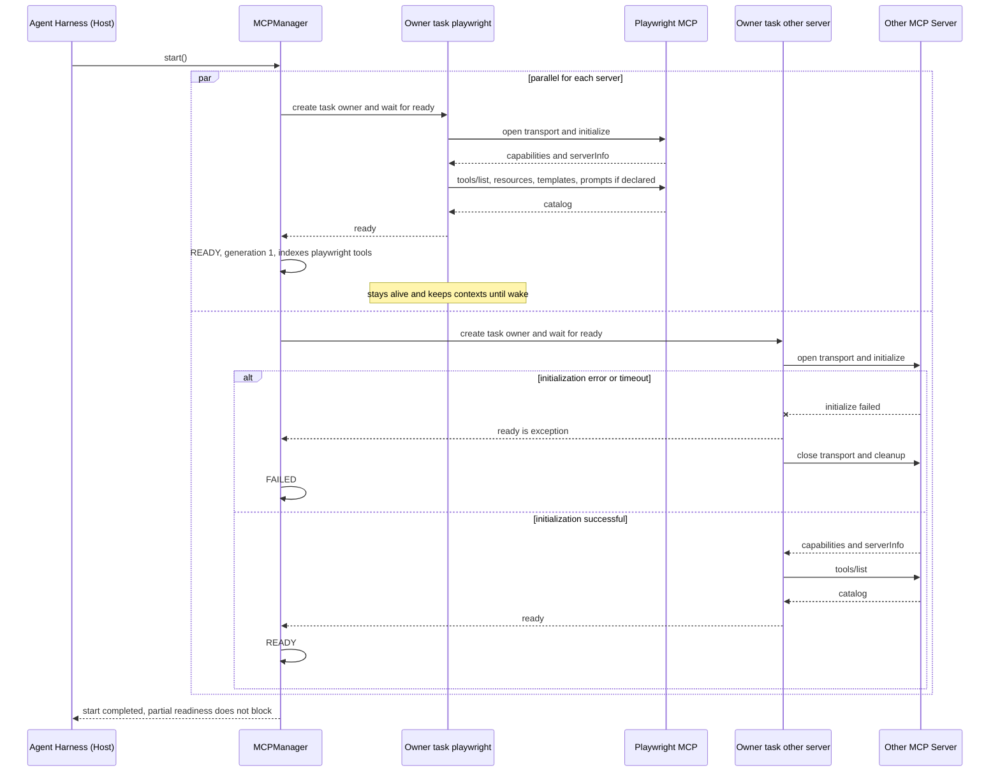
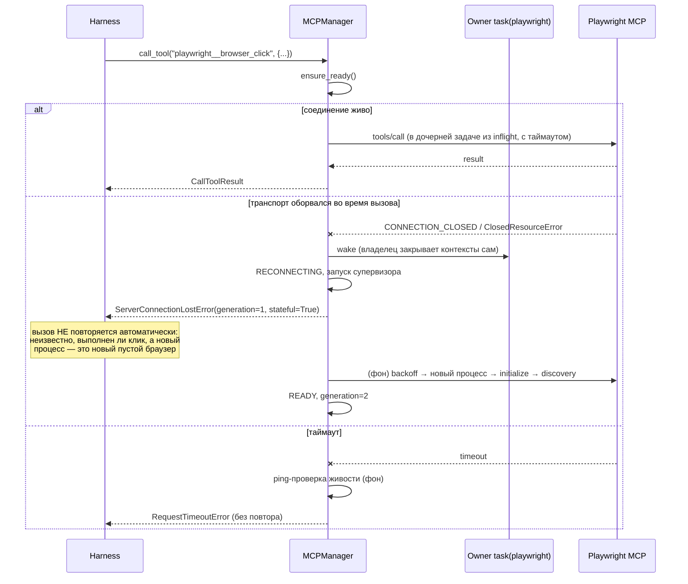
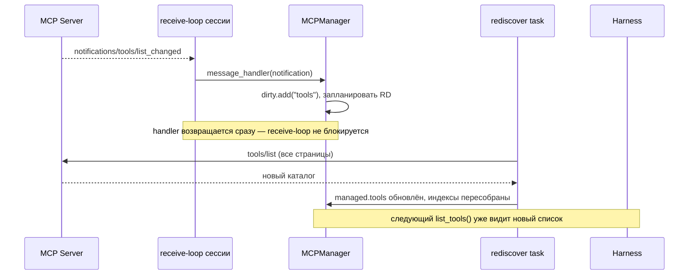
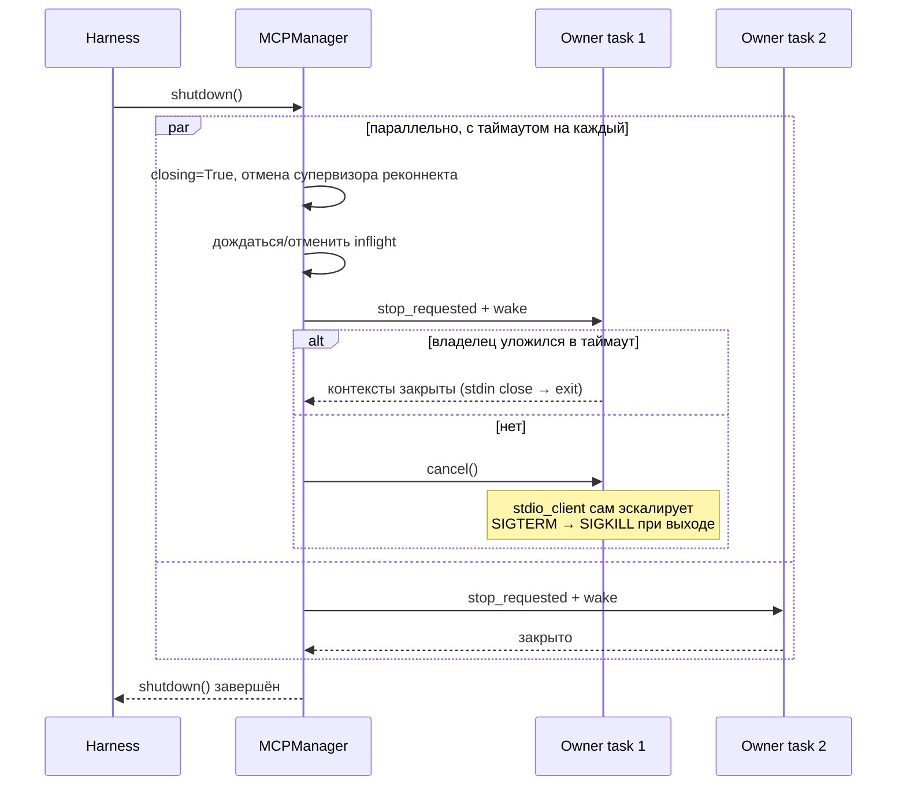

# MCP Manager — system design для AutoBrowser

Дата: 2026-09-16, **ред. 2 — 2026-09-23** (исправления по результатам ревью, список — в §9) Скоуп: **только** слой управления MCP-серверами (Manager). Осознанно не проектируются: hooks/middleware, permissions/security, observability, caching, generic tool execution framework, остальные части agent engine. Эти темы упоминаются только там, где Manager обязан оставить для них точку расширения, но не там, где они реализуются.

**Базовые версии.** Код ориентирован на ревизию спецификации MCP 2025-11-25 и API `mcp` (python-sdk) ветки **1.x**, Python ≥ 3.11 (используется `Task.cancelling()`). В 2026 году вышли python-sdk 2.x (переработанный низкоуровневый API `ClientSession`, dispatcher, подписки через `listen()`) и более новая ревизия спецификации. Перед реализацией: зафиксировать версию SDK в зависимостях и сверить сигнатуры `ClientSession`, `message_handler`, коды ошибок и механизм уведомлений с выбранной версией.

---

## 0. Идея в одном абзаце

В терминах самой MCP-спецификации то, что вы называете "MCP Manager", — это часть роли **Host**: приложение, которое создаёт и держит N Client-инстансов, каждый в отношении 1:1 с одним Server, управляет их жизненным циклом и агрегирует то, что они предоставляют. Ваш agent loop (harness) — это Host **минус** та часть, которую мы выносим в отдельный переиспользуемый компонент. MCP Manager — это Host-обвязка: registry серверов, пул Client-ов, discovery, routing, lifecycle. Playwright MCP не получает никакого специального пути — это просто одна из записей в registry (единственное, что он заявляет о себе в конфиге, — флаг `stateful: true`, см. §3.1).

---

## 1. Слои и ответственность

|Слой|Что делает|Что НЕ делает|
|---|---|---|
|**Agent Harness (Host)**|Agent loop, обращение к LLM, решение "вызвать тул X с аргументами Y", владение понятием задачи/сессии пользователя, решение, что делать при потере состояния stateful-сервера|Не знает про транспорты, JSON-RPC, реконнекты — видит только `MCPManager.list_tools()` / `call_tool()` и типизированные ошибки|
|**MCP Manager**|Registry конфигов серверов; пул Client-ов (1 на сервер); lifecycle (connect/initialize/reconnect/graceful shutdown) через задачу-владельца на каждое соединение; discovery (tools/resources/resource templates/prompts) и агрегация в единый каталог; routing вызова к нужному серверу; хранение runtime-состояния каждого соединения|Не решает, какой тул вызвать; не проверяет права на вызов; не логирует/трейсит; не кэширует бизнес-результаты вызовов (кэш _каталога_ — не то же самое, см. §3.2); **не повторяет автоматически `tools/call`** (см. §3.6)|
|**MCP Client**|Один объект = одно stateful-соединение с одним Server: транспорт + `ClientSession`, `initialize`, `tools/list`, `tools/call`, `resources/*`, `prompts/*`, приём нотификаций|Не знает о существовании других серверов, не принимает решений о реконнекте (это делает Manager, Client только исполняет)|
|**MCP Server**|Внешний процесс/сервис (Playwright MCP, filesystem MCP, ваш собственный MCP и т.д.)|Ничего не знает о Manager/Harness — просто говорит по протоколу|

Это разделение прямо повторяет архитектурный раздел спецификации: Host создаёт и управляет несколькими Client-ами, контролирует их lifecycle и права, агрегирует контекст; каждый Client держит ровно одну stateful-сессию с одним сервером (1:1), отвечает за согласование capabilities, маршрутизацию сообщений, подписки/нотификации и границы между серверами. Похожее разнесение есть и в существующих реализациях — например, в mcp-agent `ServerRegistry` (конфигурация) отделён от `MCPConnectionManager` (живые соединения). Там, где эти слои размыты, платят сложностью реконнектов и трудноуловимыми гонками.

---

## 2. Модель состояния

Осознанно держим **три раздельных структуры данных**, а не одну:

1. **ServerRegistry** — декларативная конфигурация. Что за серверы существуют и как к ним подключаться. Статична, source of truth, обычно приходит из вашего YAML/JSON-конфига. Не содержит соединений.
2. **Runtime connection state** — по одному объекту `ManagedServer` на сервер: текущее состояние (enum), живой `ClientSession`, задача-владелец соединения, согласованные capabilities, номер «поколения» соединения, последняя ошибка, счётчик попыток реконнекта.
3. **Discovered catalog** — то, что реально отдал сервер через `*/list`: тулы/ресурсы/шаблоны ресурсов/промпты, с namespaced-именами для routing. Инвалидируется точечно по нотификациям, а не только один раз при коннекте.

### 2.1 Конфигурация серверов

```python
from __future__ import annotations
import os
import re
from typing import Annotated, Literal, Union
from pydantic import BaseModel, Field, field_validator

_ENV_REF = re.compile(r"\$\{([A-Za-z_][A-Za-z0-9_]*)\}")

def _expand_env_strict(value: str) -> str:
    """${VAR} -> значение переменной окружения. pydantic-settings сам этого
    НЕ делает для значений из YAML/JSON, а os.path.expandvars молча оставляет
    неизвестные переменные как есть — поэтому своя строгая версия."""
    def repl(m: re.Match) -> str:
        name = m.group(1)
        if name not in os.environ:
            raise ValueError(f"environment variable {name} is not set")
        return os.environ[name]
    return _ENV_REF.sub(repl, value)

class ReconnectPolicy(BaseModel):
    enabled: bool = True
    max_attempts: int = 5
    base_delay_s: float = 1.0
    max_delay_s: float = 30.0

class _BaseServerConfig(BaseModel):
    connection_mode: Literal["persistent", "ephemeral"] = "persistent"
    # True -> перезапуск сервера = потеря его состояния (браузер, страницы, куки).
    # Manager не прячет такой реконнект от Harness, см. §3.1 и §3.6.
    stateful: bool = False
    init_timeout_s: float = 30.0      # initialize + первичный discovery
    request_timeout_s: float = 30.0   # list/read/get_prompt/ping
    call_timeout_s: float = 60.0      # tools/call
    ping_timeout_s: float = 5.0
    reconnect: ReconnectPolicy = Field(default_factory=ReconnectPolicy)

class StdioServerConfig(_BaseServerConfig):
    transport: Literal["stdio"]
    command: str
    args: list[str] = Field(default_factory=list)
    # None -> SDK подставит безопасный набор переменных по умолчанию;
    # заданный dict SDK мёржит поверх этого набора
    env: dict[str, str] | None = None
    cwd: str | None = None

    @field_validator("env", mode="after")
    @classmethod
    def _expand(cls, v: dict[str, str] | None) -> dict[str, str] | None:
        return None if v is None else {k: _expand_env_strict(x) for k, x in v.items()}

class StreamableHttpServerConfig(_BaseServerConfig):
    transport: Literal["streamable_http"]
    url: str
    headers: dict[str, str] = Field(default_factory=dict)

    @field_validator("headers", mode="after")
    @classmethod
    def _expand(cls, v: dict[str, str]) -> dict[str, str]:
        return {k: _expand_env_strict(x) for k, x in v.items()}

# Настоящий discriminated union по полю `transport` (без Field(discriminator=...)
# pydantic v2 валидирует Union в "smart"-режиме перебором вариантов, а не по тегу).
# Добавление нового транспорта = новый вариант здесь + одна фабрика в §3.7.
MCPServerConfig = Annotated[
    Union[StdioServerConfig, StreamableHttpServerConfig],
    Field(discriminator="transport"),
]
```

Естественно ложится рядом с существующим `config.py` на pydantic-settings:

```python
class AutoBrowserSettings(BaseSettings):
    ...
    mcp_servers: dict[str, MCPServerConfig] = Field(default_factory=dict)
```

т.е. `mcp_servers` — ещё один ключ в том же YAML/JSON, который уже подключается к конфигу (через `YamlConfigSettingsSource` или аналог). Никакого отдельного механизма конфигурации изобретать не нужно; единственное добавление — явная подстановка `${VAR}` в валидаторах выше.

### 2.2 Connection state machine



```python
from enum import Enum

class ConnectionState(str, Enum):
    DISCONNECTED = "disconnected"
    CONNECTING = "connecting"
    READY = "ready"
    RECONNECTING = "reconnecting"
    FAILED = "failed"
```

Сознательно **не** включаю сюда `NeedsAuth`/`Disabled` (как в Claude Code) — это относится к auth/permissions, которые вне скоупа. Если понадобится позже, это отдельные состояния поверх этой же машины, а не переделка.

### 2.3 Runtime-объект сервера

```python
import asyncio
from dataclasses import dataclass, field
from mcp import ClientSession
from mcp.types import ServerCapabilities, Implementation

@dataclass
class ToolDescriptor:
    server: str
    local_name: str            # как назвал сервер
    input_schema: dict
    description: str | None
    qualified_name: str = ""   # назначается при сборке индекса (§3.3) — то, что видит Harness/LLM

@dataclass
class ResourceDescriptor:
    server: str
    uri: str
    name: str | None
    mime_type: str | None

@dataclass
class ResourceTemplateDescriptor:
    server: str
    uri_template: str
    name: str | None
    mime_type: str | None

@dataclass
class PromptDescriptor:
    server: str
    local_name: str
    description: str | None
    qualified_name: str = ""

@dataclass
class ManagedServer:
    name: str
    config: MCPServerConfig
    state: ConnectionState = ConnectionState.DISCONNECTED
    session: ClientSession | None = None
    server_info: Implementation | None = None
    capabilities: ServerCapabilities | None = None

    # каталог: последний успешно полученный; переживает обрыв соединения
    tools: dict[str, ToolDescriptor] = field(default_factory=dict)
    resources: dict[str, ResourceDescriptor] = field(default_factory=dict)
    resource_templates: list[ResourceTemplateDescriptor] = field(default_factory=list)
    prompts: dict[str, PromptDescriptor] = field(default_factory=dict)
    catalog_stale: bool = False
    dirty: set[str] = field(default_factory=set)   # что передискаверить по list_changed

    last_error: str | None = None
    reconnect_attempts: int = 0
    # номер «воплощения» соединения; растёт при каждом успешном (пере)подключении.
    # Для stateful-серверов смена generation = состояние сервера потеряно.
    generation: int = 0

    # --- владение соединением (см. §3.4) ---
    owner_task: asyncio.Task | None = None      # единственная задача, которая входит/выходит из контекстов
    wake: asyncio.Event = field(default_factory=asyncio.Event)
    stop_requested: bool = False                # штатная остановка текущего воплощения
    closing: bool = False                       # shutdown/remove: не реконнектить
    lifecycle_lock: asyncio.Lock = field(default_factory=asyncio.Lock)  # сериализует connect/close/попытку реконнекта
    reconnect_task: asyncio.Task | None = None
    rediscover_task: asyncio.Task | None = None
    liveness_task: asyncio.Task | None = None
    inflight: set[asyncio.Task] = field(default_factory=set)  # запросы в полёте, см. §3.5
```

---

## 3. Ключевые архитектурные решения

### 3.1 Персистентные соединения — не session-per-call; stateful-серверы явно помечены

Ряд реализаций поддерживает два режима: эфемерная сессия на каждый вызов тула либо явно открытая персистентная сессия (например, в langchain-mcp-adapters `MultiServerMCPClient.get_tools()` по умолчанию открывает новую сессию на каждый вызов, а персистентная сессия берётся явно через `client.session(name)`). Для браузерной автоматизации это не равнозначные варианты: у Playwright MCP состояние (открытый браузерный контекст, страницы, куки, DOM) живёт **между** вызовами тулов в рамках одной задачи. Пересоздавать транспорт+сессию на каждый вызов означало бы для stdio-транспорта перезапуск процесса Playwright на каждый клик.

**Решение:**

- Manager по умолчанию держит персистентное соединение на сервер, открываемое **eager** в `start()` / `add_server()` и живущее до `shutdown()`/`remove_server()`. Чисто «ленивое» открытие при первом вызове тула невозможно: до подключения каталог пуст, и Harness/LLM просто не знают, какие тулы вызывать. Ленивое подключение остаётся только как _восстановление_: вызов тула сервера в `FAILED`/`DISCONNECTED` по последнему известному каталогу пытается подключиться заново (§4, `_ensure_ready`).
- Эфемерный режим — расширение уровня конфигурации (`connection_mode: ephemeral`) для безсостоятельных серверов, а не архитектурная развилка. Оговорка: в эфемерном режиме некому принимать `list_changed`-нотификации, каталог такого сервера придётся обновлять периодическим перезапросом.
- **Реконнект stateful-сервера — это не прозрачная операция.** Для stdio-транспорта реконнект = новый процесс Playwright = новый пустой браузер. Manager не маскирует это: соединение получает новый `generation`, вызов, во время которого оборвался транспорт, завершается `ServerConnectionLostError(stateful=True)`, а решение (перезапустить задачу, заново открыть страницу, сообщить пользователю) принимает Harness.
- **Открытый вопрос (вне скоупа Manager, но влияет на него):** один процесс Playwright MCP = один браузер на всех. Если AutoBrowser выполняет несколько пользовательских задач параллельно, общая персистентная сессия означает, что задачи делят вкладки и куки. Варианты — отдельный экземпляр сервера на задачу (`add_server("playwright-<task_id>", ...)`, дизайн Manager это уже позволяет) либо режимы изоляции самого Playwright MCP. Решение принимается на уровне Harness.

### 3.2 Discovery: eager + событийная инвалидация, не "один раз и навсегда"

Спецификация предусматривает, что набор tools/resources/prompts не статичен: сервер декларирует `listChanged` в capabilities при инициализации и при изменении списка **SHOULD** отправить `notifications/tools/list_changed` (и отдельно для resources/prompts). Перезапрос списка клиентом — ожидаемая реакция, а не MUST-требование спецификации; Manager делает его всегда.

**Решение:**

- После успешного `initialize()` Manager сразу вызывает `*/list` только для тех примитивов, которые сервер заявил в capabilities (нет `capabilities.resources` — не дёргаем `resources/list`). Для resources дополнительно запрашивается `resources/templates/list`: без шаблонов часть ресурсов сервера просто не видна.
- Обработчик нотификаций передаётся **в конструктор** `ClientSession(..., message_handler=...)` — в python-sdk 1.x нет метода вида `set_notification_handlers()`, а обработчик по умолчанию молча отбрасывает все серверные нотификации. Регистрация в конструкторе заодно убирает окно, в котором нотификация, пришедшая во время первичного discovery, теряется.
- **Обработчик нельзя блокировать запросами к тому же серверу.** В 1.x `message_handler` вызывается внутри receive-loop сессии; если прямо в нём сделать `await session.list_tools()`, ответ не будет прочитан (его должен прочитать тот же заблокированный цикл) — дедлок. Поэтому обработчик только помечает примитив как `dirty` и планирует отдельную задачу передискаверинга, которая схлопывает серию нотификаций в один перезапрос.
- Передискаверится только соответствующий примитив у соответствующего сервера, не весь пул. `list_tools()`/`list_resources()`/`list_prompts()` со стороны Harness — синхронное чтение уже посчитанного каталога, без сетевого вызова.
- Если сервер возвращает `nextCursor`, discovery докручивает пагинацию до конца.
- Нотификации — канал «доставки по возможности». Если `tools/list` при передискаверинге упал, каталог помечается `catalog_stale`, старая версия остаётся в силе.

### 3.3 Routing: namespaced qualified names + явный обратный индекс

Проблема: у двух разных серверов легко совпадают имена тулов (`click`, `screenshot`, `read_file`). Нужен единый плоский список имён для Harness/LLM без коллизий.

**Решение:** каждому тулу присваивается `qualified_name = f"{server}__{local_name}"`. Разделитель — двойное подчёркивание, а не `::` или `.`: многие LLM tool-calling API валидируют имя функции по шаблону вида `^[a-zA-Z0-9_-]{1,64}$`, где `:` и `.` недопустимы. (Claude Code использует ту же идею с дополнительным префиксом: `mcp__<server>__<tool>`.)

Три нюанса, которые в первой редакции были упущены:

1. **Локальное имя тула может само не пройти провайдерский валидатор.** Спецификация 2025-11-25 рекомендует (SHOULD) имена тулов длиной 1–128 символов из `[A-Za-z0-9_.-]` — то есть точки допустимы, а длина вдвое больше типичного провайдерского лимита. Поэтому имя санитизируется (`[^A-Za-z0-9_-]` → `_`), а если результат длиннее лимита или уже занят — обрезается и дополняется детерминированным хэшем от `(server, local_name)`.
2. **Коллизии после санитизации** (`get.user` и `get_user` одного сервера) разрешаются тем же хэш-суффиксом, а не «последний выиграл».
3. **Обратный разбор строки не используется.** При обратном `split("__")` имя сервера с `__` внутри ломает парсинг (`mcp__my__server__tool` → сервер `my`). Поэтому routing не полагается на парсинг: при сборке индекса заполняется явный

```python
self._tool_index: dict[str, tuple[str, str]] = {}   # qualified_name -> (server, local_name)
```

и `call_tool()` смотрит туда напрямую. Дополнительно имя сервера при регистрации валидируется: `^[A-Za-z0-9-]+(?:_[A-Za-z0-9-]+)*$` (без `__` и без подчёркивания по краям), длина ≤ 32 — чтобы оставить место под имя тула в 64-символьном лимите.

```python
import hashlib

_UNSAFE = re.compile(r"[^A-Za-z0-9_-]")
_SERVER_NAME = re.compile(r"^[A-Za-z0-9-]+(?:_[A-Za-z0-9-]+)*$")
MAX_TOOL_NAME = 64   # минимальный общий лимит используемых LLM API — вынести в настройки

def _validate_server_name(name: str) -> None:
    if len(name) > 32 or not _SERVER_NAME.fullmatch(name):
        raise ValueError(f"invalid MCP server name: {name!r}")

def _qualify(server: str, local: str, taken: dict[str, object]) -> str:
    base = f"{server}__{_UNSAFE.sub('_', local)}"
    if len(base) <= MAX_TOOL_NAME and base not in taken:
        return base
    digest = hashlib.sha1(f"{server}\x00{local}".encode()).hexdigest()[:8]
    return f"{base[:MAX_TOOL_NAME - 9]}_{digest}"
```

Имена должны быть стабильны между пересборками индекса: LLM держит их в контексте диалога.

**Ресурсы** роутятся по URI, и два сервера вполне могут отдать одинаковый URI (например, `file:///workspace/a.txt`). Поэтому есть отдельный индекс `uri -> [servers]`: однозначный URI роутится автоматически, неоднозначный или порождённый шаблоном требует явного `server=` в `read_resource()`.

### 3.4 Владение соединением: одна задача входит в контексты и выходит из них

Это главное исправление относительно первой редакции. Транспорты python-sdk (`stdio_client`, `streamablehttp_client`) и `ClientSession` построены на anyio task groups / cancel scopes. anyio запрещает выходить из cancel scope не в той задаче, в которой в него вошли: `RuntimeError: Attempted to exit cancel scope in a different task than it was entered in`. В первой редакции `AsyncExitStack` открывался в задаче, созданной `asyncio.gather` внутри `start()`, а закрывался в другой задаче `gather` внутри `shutdown()`, реконнект — вообще из задачи вызывающего `call_tool`. Это ровно тот сценарий, который массово ловят на практике (python-sdk #79, #577 и аналогичные issues в langchain-mcp-adapters, google-adk, agno).

**Решение — задача-владелец (owner task) на каждое воплощение соединения:**

- `_connect` создаёт долгоживущую задачу `_owner`, которая: открывает транспорт → создаёт `ClientSession` → `initialize()` → первичный discovery → сигнализирует готовность через `Future` → **ждёт** события `wake` → выходит из всех контекстов. Вход и выход из контекстов гарантированно происходят в одной задаче.
- Запросы (`call_tool`, `list_*`, `ping`) можно слать из любых задач — это безопасно; ограничение касается только входа/выхода из контекстных менеджеров.
- Остановка — не `exit_stack.aclose()` из чужой задачи, а «разбудить владельца и дождаться его завершения»; при зависании — `owner_task.cancel()`, и контексты всё равно закрываются внутри задачи-владельца.
- Тот же паттерн используют зрелые реализации (lifecycle-задача на сервер в `MCPConnectionManager` mcp-agent).

`lifecycle_lock` при этом сериализует _переходы_ (connect / close / одна попытка реконнекта), чтобы два конкурентных `_ensure_ready` не подняли два процесса Playwright. Он **не** защищает запросы в полёте — для этого §3.5.

### 3.5 Запросы в полёте, таймауты и классификация ошибок

В первой редакции утверждалось, что `asyncio.Lock` на переходах защищает от гонки «реконнект во время `call_tool`». Это неверно: `call_tool` лок не берёт, поэтому лок никак не синхронизирует переход с запросами в полёте. Кроме того, описанный баг был сформулирован неточно: в python-sdk задокументированы зависания клиентского запроса навсегда, если сервер умер во время вызова (#1577), если stdio-сервер завершился (#396), при определённых комбинациях таймаутов streamable HTTP (#1789), а исключения транспорта по умолчанию уходят в `message_handler` и молча глотаются (#1401).

**Решение:**

- **Таймаут на каждом запросе — обязателен.** Используется штатный механизм SDK: `read_timeout_seconds` в конструкторе `ClientSession` (для list/read/get_prompt/ping) и per-call `read_timeout_seconds` в `call_tool`. По спецификации при таймауте клиенту SHOULD отправить `notifications/cancelled`; нужно проверить, делает ли это выбранная версия SDK.
- **Учёт запросов в полёте.** Каждый запрос выполняется в дочерней задаче, зарегистрированной в `managed.inflight`. При остановке соединения Manager сначала даёт им завершиться (половина таймаута закрытия), затем отменяет оставшиеся; вызывающий получает `ServerClosedError`, а не вечное ожидание.
- **Классификация ошибок** (нужна Harness, чтобы решать, повторять ли действие):

|Что случилось|Как видно в SDK 1.x|Что делает Manager|Что получает Harness|
|---|---|---|---|
|Тул отработал с ошибкой|`CallToolResult.isError = True`|ничего|результат как есть|
|Протокольная ошибка (нет тула, неверные параметры)|`McpError` с JSON-RPC кодом|ничего|`McpError`|
|Таймаут запроса|`McpError` с кодом таймаута (408 в 1.x)|планирует ping-проверку живости|`RequestTimeoutError`|
|Обрыв транспорта|`McpError` с `CONNECTION_CLOSED` или `anyio.ClosedResourceError` / `BrokenResourceError` / `EndOfStream`|переводит сервер в `RECONNECTING`/`FAILED`|`ServerConnectionLostError(generation, stateful)`|
|Соединение закрыто Manager-ом|отмена дочерней задачи|—|`ServerClosedError`|

Встроенный `ConnectionError`, который ловила первая редакция, python-sdk при обрыве не поднимает. Точные коды ошибок надо сверить с выбранной версией SDK.

- **Исключения транспорта в `message_handler`** не считаются автоматически фатальными: обработчик запускает лёгкую проверку живости (`send_ping()` с таймаутом), и только её провал переводит соединение в «потеряно». Это одноразовая проверка по событию; периодический health-loop — по-прежнему отложенный вариант C (§7).

### 3.6 Реконнект и политика повторов

**Реконнект** — фоновая задача-супервизор, а не цикл под локом:

```python
async def _supervise_reconnect(self, managed: ManagedServer) -> None:
    policy = managed.config.reconnect
    old = managed.owner_task
    if old is not None:
        await asyncio.wait({old})                  # старое воплощение закрывает свои контексты само
    for attempt in range(1, policy.max_attempts + 1):
        managed.reconnect_attempts = attempt
        await asyncio.sleep(min(policy.base_delay_s * 2 ** (attempt - 1), policy.max_delay_s))
        async with managed.lifecycle_lock:          # лок — только на одну попытку, НЕ на sleep
            if managed.closing:
                return
            try:
                await self._start_owner(managed)
                return
            except ServerUnavailableError:
                continue
    managed.state = ConnectionState.FAILED
```

Отличия от первой редакции: (1) лок не удерживается во время `sleep` — иначе `shutdown()` ждал бы окончания всей серии попыток, вопреки переходу `Reconnecting → Disconnected` на state-диаграмме; (2) супервизор отменяем (`shutdown()`/`remove_server()` вызывают `reconnect_task.cancel()`); (3) старое воплощение закрывается в своей задаче-владельце, а не утекает — в первой редакции реконнект открывал новый `exit_stack`, не закрыв старый, т.е. оставлял живым старый процесс сервера.

С дефолтами (`base=1s`, 5 попыток) задержки — 1, 2, 4, 8, 16 с; потолок `max_delay_s=30s` при этом не достигается и нужен только при увеличении числа попыток. Для справки: Claude Code по документации переподключает с такой же схемой (до пяти попыток, задержка с 1 с с удвоением) **только удалённые HTTP/SSE-серверы**; stdio-серверы он автоматически не переподключает. У нас stdio-реконнект разрешён, но для stateful-серверов он явно виден Harness через `generation` (§3.1).

Триггеры реконнекта: (а) обрыв транспорта, замеченный на запросе или ping-проверкой; (б) неожиданное завершение задачи-владельца; (в) ручной `reconnect(name)`; (г) в будущем — фоновый health-loop (§7).

**Повторы запросов:**

- `tools/call` **никогда не повторяется автоматически.** При обрыве или таймауте неизвестно, выполнил ли сервер действие: повтор `click`/`submit` может выполнить его дважды, а для stateful-сервера повтор после реконнекта исполняется уже в новом пустом браузере — то есть не в том контексте, в котором Harness его планировал. В первой редакции `call_tool` делал реконнект и повтор; это убрано.
- Идемпотентные операции (`read_resource`, `get_prompt`) повторяются один раз после восстановления соединения.
- Решение о повторе `tools/call` принимает Harness на основании типа ошибки (§3.5) и `stateful`.

### 3.7 Transport abstraction: фабрика по типу, без спецкейсов

```python
from datetime import timedelta
from typing import AsyncContextManager, Callable
from mcp import StdioServerParameters
from mcp.client.stdio import stdio_client
from mcp.client.streamable_http import streamablehttp_client   # имя сверить с версией SDK

def _open_stdio_transport(cfg: StdioServerConfig) -> AsyncContextManager:
    return stdio_client(StdioServerParameters(
        command=cfg.command, args=cfg.args, env=cfg.env, cwd=cfg.cwd))

def _open_streamable_http_transport(cfg: StreamableHttpServerConfig) -> AsyncContextManager:
    return streamablehttp_client(cfg.url, headers=cfg.headers)

_TRANSPORT_FACTORIES: dict[str, Callable[..., AsyncContextManager]] = {
    "stdio": _open_stdio_transport,
    "streamable_http": _open_streamable_http_transport,
}
```

`stdio_client` отдаёт `(read, write)`, `streamablehttp_client` — `(read, write, get_session_id)`, поэтому распаковка `read, write, *_`. Playwright MCP **не упоминается нигде в этом модуле** — он просто оказывается записью `{transport: "stdio", command: "npx", args: [...], stateful: true}` в конфиге. SSE-транспорт в спецификации объявлен устаревшим (с ревизии 2025-03-26), добавлять его стоит только ради legacy-серверов.

### 3.8 Graceful shutdown: параллельно, с таймаутом, через задачи-владельцы

- Закрытие всех серверов идёт параллельно (`asyncio.gather(..., return_exceptions=True)`) — один зависший stdio-процесс не задерживает остановку остальных. С задачами-владельцами это безопасно: `gather` лишь будит владельцев и ждёт их, из чужих контекстов никто не выходит.
- Порядок для одного сервера: пометить `closing` → отменить супервизор реконнекта → под `lifecycle_lock`: дать запросам в полёте завершиться, отменить оставшиеся → разбудить владельца → ждать до таймаута → при превышении `owner_task.cancel()`.
- Отдельный `_force_kill_if_stdio` из первой редакции не нужен и фактически не реализуем (после отмены `aclose()` дескриптор процесса недоступен извне). Спецификация описывает для stdio последовательность «закрыть stdin → подождать → SIGTERM → SIGKILL», и `stdio_client` в актуальных 1.x выполняет эскалацию сам при выходе из контекста, в том числе при отмене задачи-владельца. Проверить на выбранной версии SDK тестом «сервер игнорирует закрытие stdin».

---

## 4. Публичный интерфейс `MCPManager`

```python
import asyncio
import contextlib
from datetime import timedelta
import anyio
from pydantic import AnyUrl
from mcp import ClientSession, McpError, types

# --- ошибки ---------------------------------------------------------------

class MCPManagerError(Exception): ...
class UnknownServerError(MCPManagerError): ...
class UnknownToolError(MCPManagerError): ...
class UnknownPromptError(MCPManagerError): ...
class UnknownResourceError(MCPManagerError): ...
class AmbiguousResourceError(MCPManagerError): ...
class ServerUnavailableError(MCPManagerError): ...
class ServerClosedError(MCPManagerError): ...
class RequestTimeoutError(MCPManagerError): ...

class ServerConnectionLostError(MCPManagerError):
    """Транспорт оборвался во время запроса. Выполнился ли запрос на сервере — неизвестно.
    stateful=True: после реконнекта это будет новый экземпляр сервера без прежнего состояния."""
    def __init__(self, server: str, generation: int, stateful: bool):
        super().__init__(f"{server}: connection lost (generation {generation})")
        self.server, self.generation, self.stateful = server, generation, stateful

_TRANSPORT_ERRORS = (anyio.ClosedResourceError, anyio.BrokenResourceError, anyio.EndOfStream)

def _is_connection_closed(exc: McpError) -> bool:
    return exc.error.code == types.CONNECTION_CLOSED     # сверить с версией SDK

def _is_timeout(exc: McpError) -> bool:
    return exc.error.code == 408                          # SDK 1.x: REQUEST_TIMEOUT; сверить

_LIST_CHANGED = {
    types.ToolListChangedNotification: "tools",
    types.ResourceListChangedNotification: "resources",
    types.PromptListChangedNotification: "prompts",
}

@dataclass
class ServerStatus:
    state: ConnectionState
    generation: int
    last_error: str | None
    catalog_stale: bool

# --- discovery helpers ----------------------------------------------------

async def _list_all(fetch, attr: str) -> list:
    items, cursor = [], None
    while True:
        page = await fetch(cursor=cursor)
        items.extend(getattr(page, attr))
        cursor = page.nextCursor
        if not cursor:
            return items

async def _discover(managed: ManagedServer, kinds: set[str]) -> None:
    s, caps = managed.session, managed.capabilities
    if "tools" in kinds and caps.tools:
        managed.tools = {
            t.name: ToolDescriptor(managed.name, t.name, t.inputSchema, t.description)
            for t in await _list_all(s.list_tools, "tools")
        }
    if "resources" in kinds and caps.resources:
        managed.resources = {
            str(r.uri): ResourceDescriptor(managed.name, str(r.uri), r.name, r.mimeType)
            for r in await _list_all(s.list_resources, "resources")
        }
        managed.resource_templates = [
            ResourceTemplateDescriptor(managed.name, t.uriTemplate, t.name, t.mimeType)
            for t in await _list_all(s.list_resource_templates, "resourceTemplates")
        ]
    if "prompts" in kinds and caps.prompts:
        managed.prompts = {
            p.name: PromptDescriptor(managed.name, p.name, p.description)
            for p in await _list_all(s.list_prompts, "prompts")
        }
    managed.catalog_stale = False

# --- manager --------------------------------------------------------------

class MCPManager:
    def __init__(self, registry: ServerRegistry):
        self._registry = registry
        self._servers: dict[str, ManagedServer] = {}
        for name, cfg in registry.all().items():
            _validate_server_name(name)
            self._servers[name] = ManagedServer(name=name, config=cfg)
        self._tool_index: dict[str, tuple[str, str]] = {}
        self._prompt_index: dict[str, tuple[str, str]] = {}
        self._resource_index: dict[str, list[str]] = {}

    # --- lifecycle --------------------------------------------------------

    async def start(self) -> None:
        """Параллельный коннект всех серверов. Одна упавшая инициализация не блокирует
        остальные — Manager поднимается частично готовым, упавшие видны в status()."""
        await asyncio.gather(
            *(self._connect(s) for s in self._servers.values()),
            return_exceptions=True,
        )

    async def add_server(self, name: str, config: MCPServerConfig, *, connect: bool = True) -> None:
        """Динамическая регистрация — без перезапуска harness и без нового кода."""
        _validate_server_name(name)
        if name in self._servers:
            raise ValueError(f"server {name!r} already registered")
        self._registry.add(name, config)
        managed = ManagedServer(name=name, config=config)
        self._servers[name] = managed
        if connect:
            await self._connect(managed)   # при ошибке сервер остаётся в FAILED, исключение — вызывающему

    async def remove_server(self, name: str, timeout: float = 5.0) -> None:
        managed = self._get(name)
        await self._close(managed, timeout)
        del self._servers[name]
        self._registry.remove(name)
        self._rebuild_indexes()

    async def reconnect(self, name: str, timeout: float = 5.0) -> None:
        managed = self._get(name)
        await self._close(managed, timeout)
        await self._connect(managed)

    async def shutdown(self, timeout: float = 5.0) -> None:
        await asyncio.gather(
            *(self._close(s, timeout) for s in list(self._servers.values())),
            return_exceptions=True,
        )

    # --- discovery / каталог ------------------------------------------------

    def list_tools(self) -> list[ToolDescriptor]:
        """То, что сейчас можно предлагать LLM: только READY-серверы."""
        return [t for s in self._servers.values() if s.state is ConnectionState.READY
                for t in s.tools.values()]

    def list_resources(self) -> list[ResourceDescriptor]:
        return [r for s in self._servers.values() if s.state is ConnectionState.READY
                for r in s.resources.values()]

    def list_resource_templates(self) -> list[ResourceTemplateDescriptor]:
        return [t for s in self._servers.values() if s.state is ConnectionState.READY
                for t in s.resource_templates]

    def list_prompts(self) -> list[PromptDescriptor]:
        return [p for s in self._servers.values() if s.state is ConnectionState.READY
                for p in s.prompts.values()]

    def status(self) -> dict[str, ServerStatus]:
        return {n: ServerStatus(s.state, s.generation, s.last_error, s.catalog_stale)
                for n, s in self._servers.items()}

    # --- routing / вызовы -------------------------------------------------

    async def call_tool(self, qualified_name: str, arguments: dict) -> types.CallToolResult:
        route = self._tool_index.get(qualified_name)
        if route is None:
            raise UnknownToolError(qualified_name)
        server_name, local_name = route
        managed = self._servers[server_name]
        timeout = timedelta(seconds=managed.config.call_timeout_s)
        return await self._request(
            managed,
            lambda s: s.call_tool(local_name, arguments, read_timeout_seconds=timeout),
            idempotent=False,          # никаких автоматических повторов, см. §3.6
        )

    async def read_resource(self, uri: str, *, server: str | None = None) -> types.ReadResourceResult:
        if server is None:
            owners = self._resource_index.get(uri, [])
            if not owners:
                raise UnknownResourceError(uri)        # URI из шаблона — передайте server явно
            if len(owners) > 1:
                raise AmbiguousResourceError(uri, owners)
            server = owners[0]
        return await self._request(self._get(server),
                                   lambda s: s.read_resource(AnyUrl(uri)), idempotent=True)

    async def get_prompt(self, qualified_name: str, arguments: dict[str, str]) -> types.GetPromptResult:
        route = self._prompt_index.get(qualified_name)
        if route is None:
            raise UnknownPromptError(qualified_name)
        server_name, local_name = route
        return await self._request(self._servers[server_name],
                                   lambda s: s.get_prompt(local_name, arguments), idempotent=True)

    # --- internal: запросы ------------------------------------------------

    async def _request(self, managed: ManagedServer, op, *, idempotent: bool):
        for attempt in (1, 2):
            await self._ensure_ready(managed)
            generation = managed.generation
            task = asyncio.create_task(op(managed.session))
            managed.inflight.add(task)
            task.add_done_callback(managed.inflight.discard)
            try:
                return await task
            except asyncio.CancelledError:
                if asyncio.current_task().cancelling():   # отменили самого вызывающего
                    raise
                raise ServerClosedError(managed.name) from None   # запрос оборвал close/shutdown
            except _TRANSPORT_ERRORS as exc:
                lost: BaseException = exc
            except McpError as exc:
                if _is_timeout(exc):
                    self._schedule_liveness_check(managed)
                    raise RequestTimeoutError(managed.name) from exc
                if not _is_connection_closed(exc):
                    raise                                  # протокольная ошибка — как есть
                lost = exc
            # сюда попадаем только при обрыве транспорта
            self._mark_transport_lost(managed)
            if not idempotent or attempt == 2:
                raise ServerConnectionLostError(
                    managed.name, generation, managed.config.stateful) from lost

    async def _ensure_ready(self, managed: ManagedServer) -> None:
        if managed.state is ConnectionState.READY:
            return
        if managed.state is ConnectionState.RECONNECTING and managed.reconnect_task:
            await asyncio.wait({managed.reconnect_task})   # дождаться серии попыток, не плодить свои
        elif managed.state in (ConnectionState.DISCONNECTED, ConnectionState.FAILED,
                               ConnectionState.CONNECTING):
            with contextlib.suppress(ServerUnavailableError):
                await self._connect(managed)               # single-flight под lifecycle_lock
        if managed.state is not ConnectionState.READY:
            raise ServerUnavailableError(managed.name, managed.last_error)

    # --- internal: lifecycle ------------------------------------------------

    async def _connect(self, managed: ManagedServer) -> None:
        async with managed.lifecycle_lock:
            if managed.state is ConnectionState.READY:
                return
            managed.closing = False
            managed.state = ConnectionState.CONNECTING
            try:
                await self._start_owner(managed)
            except Exception:
                managed.state = ConnectionState.FAILED
                raise

    async def _start_owner(self, managed: ManagedServer) -> None:
        ready = asyncio.get_running_loop().create_future()
        managed.stop_requested = False
        managed.wake = asyncio.Event()
        task = asyncio.create_task(self._owner(managed, ready), name=f"mcp-owner:{managed.name}")
        managed.owner_task = task
        task.add_done_callback(lambda t: self._on_owner_exit(managed, t))
        try:
            await ready
        except asyncio.CancelledError:
            if asyncio.current_task().cancelling():
                raise
            raise ServerClosedError(managed.name) from None
        except Exception as exc:
            raise ServerUnavailableError(managed.name, managed.last_error) from exc
        managed.state = ConnectionState.READY
        managed.generation += 1
        managed.reconnect_attempts = 0
        managed.last_error = None
        self._rebuild_indexes()
        if managed.dirty:                       # list_changed пришёл во время первичного discovery
            self._schedule_rediscover(managed)

    async def _owner(self, managed: ManagedServer, ready: asyncio.Future) -> None:
        """Единственная задача, которая входит в контексты транспорта/сессии и выходит из них."""
        cfg = managed.config
        try:
            async with contextlib.AsyncExitStack() as stack:
                read, write, *_ = await stack.enter_async_context(
                    _TRANSPORT_FACTORIES[cfg.transport](cfg))
                session = await stack.enter_async_context(ClientSession(
                    read, write,
                    read_timeout_seconds=timedelta(seconds=cfg.request_timeout_s),
                    message_handler=self._make_message_handler(managed),
                ))
                with anyio.fail_after(cfg.init_timeout_s):
                    init = await session.initialize()
                    managed.session = session
                    managed.server_info = init.serverInfo
                    managed.capabilities = init.capabilities
                    await _discover(managed, {"tools", "resources", "prompts"})
                if not ready.done():
                    ready.set_result(None)
                await managed.wake.wait()      # держим соединение до stop/обрыва
        except asyncio.CancelledError:
            if not ready.done():
                ready.cancel()
            raise
        except Exception as exc:
            managed.last_error = repr(exc)
            if not ready.done():
                ready.set_exception(exc)
        finally:
            managed.session = None

    def _on_owner_exit(self, managed: ManagedServer, task: asyncio.Task) -> None:
        if managed.owner_task is not task:
            return
        managed.session = None
        if managed.stop_requested or managed.closing:
            return                                  # штатная остановка
        if managed.state is ConnectionState.READY:  # владелец завершился сам
            self._mark_transport_lost(managed)

    def _mark_transport_lost(self, managed: ManagedServer) -> None:
        if managed.state is not ConnectionState.READY or managed.closing:
            return
        managed.wake.set()                          # владелец закроет контексты в своей задаче
        if managed.config.reconnect.enabled:
            managed.state = ConnectionState.RECONNECTING
            managed.reconnect_task = asyncio.create_task(self._supervise_reconnect(managed))
        else:
            managed.state = ConnectionState.FAILED

    # _supervise_reconnect — см. §3.6

    async def _close(self, managed: ManagedServer, timeout: float) -> None:
        managed.closing = True
        if managed.reconnect_task and not managed.reconnect_task.done():
            managed.reconnect_task.cancel()
        async with managed.lifecycle_lock:
            await self._stop_owner(managed, timeout)
            managed.state = ConnectionState.DISCONNECTED

    async def _stop_owner(self, managed: ManagedServer, timeout: float) -> None:
        task = managed.owner_task
        if task is None or task.done():
            return
        if managed.inflight:                        # дать запросам завершиться, потом отменить
            _, pending = await asyncio.wait(set(managed.inflight), timeout=timeout / 2)
            for t in pending:
                t.cancel()
        managed.stop_requested = True
        managed.wake.set()
        try:
            await asyncio.wait_for(asyncio.shield(task), timeout)
        except asyncio.TimeoutError:
            task.cancel()                           # выход из контекстов — всё равно в задаче-владельце
            with contextlib.suppress(asyncio.CancelledError, Exception):
                await task

    # --- internal: нотификации, передискаверинг, живость ---------------------

    def _make_message_handler(self, managed: ManagedServer):
        async def on_message(msg) -> None:
            # Вызывается внутри receive-loop сессии: здесь НЕЛЬЗЯ ждать ответов
            # от этого же сервера (list_tools и т.п.) — будет дедлок. Только планируем.
            if isinstance(msg, Exception):
                managed.last_error = repr(msg)
                self._schedule_liveness_check(managed)
                return
            if isinstance(msg, types.ServerNotification):
                kind = _LIST_CHANGED.get(type(msg.root))
                if kind is not None:
                    self._schedule_rediscover(managed, kind)
            # серверные запросы (sampling/roots/elicitation) — вне скоупа, см. §8
        return on_message

    def _schedule_rediscover(self, managed: ManagedServer, kind: str | None = None) -> None:
        if kind:
            managed.dirty.add(kind)
        if managed.rediscover_task is None or managed.rediscover_task.done():
            managed.rediscover_task = asyncio.create_task(self._rediscover_loop(managed))

    async def _rediscover_loop(self, managed: ManagedServer) -> None:
        while managed.dirty and managed.state is ConnectionState.READY:
            kinds, managed.dirty = managed.dirty, set()      # схлопываем серию нотификаций
            try:
                await _discover(managed, kinds)
            except Exception as exc:
                managed.last_error = repr(exc)
                managed.catalog_stale = True
            self._rebuild_indexes()

    def _schedule_liveness_check(self, managed: ManagedServer) -> None:
        if managed.liveness_task is None or managed.liveness_task.done():
            managed.liveness_task = asyncio.create_task(self._check_liveness(managed))

    async def _check_liveness(self, managed: ManagedServer) -> None:
        session = managed.session
        if session is None or managed.state is not ConnectionState.READY:
            return
        try:
            with anyio.fail_after(managed.config.ping_timeout_s):
                await session.send_ping()
        except Exception:
            self._mark_transport_lost(managed)

    # --- internal: индексы ------------------------------------------------

    def _rebuild_indexes(self) -> None:
        """Индекс строится по последнему известному каталогу ВСЕХ серверов (в т.ч. упавших):
        вызов тула упавшего сервера запускает восстановление в _ensure_ready.
        list_tools() при этом показывает LLM только READY-серверы — это намеренно."""
        tools: dict[str, tuple[str, str]] = {}
        prompts: dict[str, tuple[str, str]] = {}
        resources: dict[str, list[str]] = {}
        for s in self._servers.values():
            for t in s.tools.values():
                t.qualified_name = _qualify(s.name, t.local_name, tools)
                tools[t.qualified_name] = (s.name, t.local_name)
            for p in s.prompts.values():
                p.qualified_name = _qualify(s.name, p.local_name, prompts)
                prompts[p.qualified_name] = (s.name, p.local_name)
            for uri in s.resources:
                resources.setdefault(uri, []).append(s.name)
        self._tool_index, self._prompt_index, self._resource_index = tools, prompts, resources

    def _get(self, name: str) -> ManagedServer:
        try:
            return self._servers[name]
        except KeyError:
            raise UnknownServerError(name) from None
```

`UnknownToolError`/`ServerConnectionLostError` и остальные типизированные ошибки — это те точки, где потом естественно подключится permissions/middleware слой (например, обернуть `call_tool` снаружи), но сам Manager этого не делает.

---

## 5. Sequence-диаграммы

### 5.1 Старт



### 5.2 Вызов тула и обрыв соединения во время вызова



### 5.3 Событийная переразгрузка каталога



### 5.4 Graceful shutdown



---

## 6. Пример конфигурации

```yaml
mcp_servers:
  playwright:
    transport: stdio
    command: npx
    args: ["-y", "@playwright/mcp@<pinned-version>"]   # не @latest: воспроизводимость сборок
    stateful: true
    call_timeout_s: 120

  filesystem:
    transport: stdio
    command: npx
    args: ["-y", "@modelcontextprotocol/server-filesystem@<pinned-version>", "/workspace"]

  internal_search:
    transport: streamable_http
    url: "http://localhost:9000/mcp"
    headers:
      Authorization: "Bearer ${INTERNAL_MCP_TOKEN}"   # подставляется валидатором из §2.1
```

До: browser harness импортирует playwright-специфичный adapter-класс, знает про его протокол отдельно от остального кода. После: Playwright — одна запись в `mcp_servers`, его тулы приходят как `playwright__browser_click`, `playwright__browser_navigate` и т.д. наравне с тулами любого другого сервера. Добавление нового MCP-сервера = добавление записи в YAML, без кода.

---

## 7. Рассмотренные варианты

**Вариант A (принят)** — централизованный Manager с персистентными соединениями и задачей-владельцем на соединение, описанный выше.

**Вариант B — session-per-call по умолчанию** (базовый режим `get_tools()` в langchain-mcp-adapters). Плюсы: нечего реконнектить, тривиальная модель ошибок. Минус — фатальный именно для Playwright: пересоздание транспорта на каждый вызов пересоздаёт браузерный процесс, состояние теряется между вызовами одной задачи. Отклонён как default; оставлен как per-server опция для безсостоятельных серверов (§3.1).

**Вариант "децентрализованный"** — без общего Manager, каждый Client сам разруливает свой реконнект. Отклонён: нет единой точки для агрегированного каталога, нет единого места для параллельного graceful shutdown, дублирование backoff-логики в каждом клиенте.

**Вариант C (не отклонён, а отложен) — фоновый health-loop.** Периодическая проверка живости каждого READY-соединения (`send_ping()`) в фоновой задаче, чтобы ловить «тихую» смерть сервера до того, как её обнаружит реальный вызов. Это независимое расширение: тот же `_check_liveness`/`_mark_transport_lost`, просто ещё один вызывающий; интерфейс `MCPManager` не меняется. Для stateful-серверов проактивный реконнект не спасает состояние, но позволяет Harness узнать о потере раньше.

---

## 8. Явно вне этого документа

Не спроектировано, только фиксирую точки расширения:

- **Permissions/security** — обёртка снаружи `call_tool`/`read_resource`, до того как аргумент дойдёт до `_tool_index.get(...)`. По спецификации это ответственность Host, так что слой нужен обязательно — просто не в этом документе.
- **Observability** — обёртка/декоратор вокруг публичных методов `MCPManager` и хук в `_make_message_handler` (например, для `notifications/message` — логов сервера).
- **Caching бизнес-результатов вызовов** — отдельно от discovery-кэша каталога (§3.2), который часть этого дизайна по необходимости.
- **Generic tool execution framework** (маппинг `Tool.inputSchema` в схему конкретного LLM-провайдера, повторы на уровне бизнес-логики, парсинг `CallToolResult.content`) — уровень Harness; Manager отдаёт «сырой» `CallToolResult` и типизированные ошибки.
- **Запросы сервер → клиент** (`sampling/createMessage`, `roots/list`, `elicitation/create`) и подписки на ресурсы (`resources/subscribe`). Сейчас клиент их не заявляет в capabilities, и SDK отвечает на них ошибкой. Точка расширения — колбэки конструктора `ClientSession` в `_owner`.
- **Изоляция браузера между параллельными задачами** — см. открытый вопрос в §3.1.

---

## 9. Что исправлено в ред. 2

Критичное (код в первой редакции не работал бы или вёл себя опасно):

1. **Выход из контекстов SDK в чужой задаче.** `AsyncExitStack` входил в контексты в одной задаче (`gather` в `start()`), а закрывался в другой (`gather` в `shutdown()`, задача `call_tool` при реконнекте) → `RuntimeError: Attempted to exit cancel scope in a different task`. Введена задача-владелец соединения (§3.4).
2. **Несуществующий API нотификаций.** `session.set_notification_handlers(...)` в python-sdk нет; обработчик передаётся в конструктор `ClientSession(message_handler=...)`. Регистрация «после discovery» ещё и теряла нотификации, пришедшие во время discovery (§3.2).
3. **Дедлок в обработчике нотификаций.** Перезапрос `tools/list` прямо из обработчика блокирует receive-loop, который должен прочитать ответ. Вынесено в отдельную задачу с схлопыванием (§3.2).
4. **Автоматический повтор `tools/call` после обрыва/таймаута.** Мог выполнить действие дважды, а для Playwright — выполнить его в новом пустом браузере после перезапуска процесса. Повтор убран; Harness получает типизированную ошибку с `generation` и `stateful` (§3.6).
5. **Лок не защищал запросы в полёте.** `call_tool` не брал `managed.lock`, поэтому утверждение «реконнект не может стартовать во время вызова» было неверным. Добавлены учёт `inflight`, их дренаж/отмена при закрытии и таймауты через механизм SDK (§3.5).
6. **Утечка старого соединения при реконнекте.** Реконнект открывал новый `exit_stack`, не закрыв старый (старый процесс сервера оставался жить). Теперь старое воплощение закрывается своей задачей-владельцем до новой попытки (§3.6).
7. **`shutdown()` блокировался на всю серию реконнекта.** Лок удерживался во время `asyncio.sleep` в backoff — противоречие с переходом `Reconnecting → Disconnected`. Реконнект стал отменяемым супервизором, лок берётся на одну попытку (§3.6).
8. **Ловились не те исключения.** python-sdk при обрыве не поднимает встроенный `ConnectionError`; обрыв приходит как `McpError(CONNECTION_CLOSED)` или anyio `ClosedResourceError`/`BrokenResourceError`/`EndOfStream`, таймаут — как `McpError` (§3.5).
9. **Повтор после неудачного реконнекта шёл в мёртвую сессию.** При провале `_connect_one` поле `session` не сбрасывалось, и retry в `call_tool` вызывал старую сессию. `_ensure_ready` в ветке `RECONNECTING` возвращал управление, не проверив итоговое состояние (`session=None` → `AttributeError`). Исправлено (§4).
10. **Двойное подключение.** Ветка `DISCONNECTED/FAILED` в `_ensure_ready` вызывала `_connect_one` без лока — два конкурентных вызова поднимали два процесса Playwright. Теперь single-flight под `lifecycle_lock`.
11. **Не было таймаута на `initialize()`.** При зависшем сервере `start()` висел вечно. Добавлен `init_timeout_s`.

Важное (неточности дизайна и фактов):

12. `MCPServerConfig` был описан как discriminated union, но объявлен как простой `Union` — без `Field(discriminator="transport")` pydantic выбирает вариант перебором (§2.1).
13. `${INTERNAL_MCP_TOKEN}` в YAML сам не подставляется — ни pydantic-settings, ни YAML-загрузчик этого не делают. Добавлена строгая подстановка (§2.1).
14. «Ленивое открытие при первом обращении» противоречило discovery: до подключения каталог пуст, LLM не знает, какие тулы вызвать. Подключение теперь eager, лениво — только восстановление (§3.1).
15. Не учитывались ограничения имён: MCP допускает в именах тулов точки и длину до 128 символов, провайдеры LLM — обычно до 64 без точек. Добавлены санитизация, усечение с хэшем и разрешение коллизий (§3.3).
16. Routing ресурсов по URI без индекса и без обработки коллизий между серверами; не запрашивался `resources/templates/list` (§3.2, §3.3).
17. Факты про Claude Code: формат имени — `mcp__<server>__<tool>`; автоматический реконнект с backoff (до 5 попыток, с 1 с с удвоением: 1–2–4–8–16 с) применяется **только к удалённым HTTP/SSE-серверам**, stdio он автоматически не переподключает. «1с → 30с» не соответствует документации (§3.3, §3.6).
18. `_force_kill_if_stdio` после отменённого `aclose()` нереализуем (нет доступа к процессу) и избыточен: эскалацию stdin → SIGTERM → SIGKILL делает сам `stdio_client` (§3.8).
19. Индекс тулов и `list_tools()` расходились по фильтрации (все серверы vs только READY) без объяснения. Поведение сохранено, но зафиксировано как намеренное (§4, `_rebuild_indexes`).
20. Не учитывалось, что реконнект stdio-сервера = новый процесс = потеря браузерного состояния; и что один процесс Playwright делят все параллельные задачи (§3.1).

Мелкое:

21. Формулировка «клиент обязан перезапросить список» — в спецификации это SHOULD для сервера (отправить нотификацию), а не MUST для клиента.
22. Упоминание Goose как «разобранного ниже» — ниже он не разбирался; неподтверждённые детали внутреннего устройства Claude Code (`configs/clients/tools`) убраны.
23. «mcp-use/AG2» — это разные проекты; пример заменён на проверяемый (langchain-mcp-adapters).
24. `@latest` в примере конфига заменён на закреплённую версию; порт 8931 (порт по умолчанию HTTP-режима Playwright MCP) заменён, чтобы не путать с Playwright.
25. Добавлены пропущенные переходы в state-диаграмму (`Connecting → Disconnected`, `Ready → Failed` при выключенном реконнекте), вариант A в §7, раздел о базовых версиях SDK/спецификации.

---

## 10. Источники

- Спецификация MCP 2025-11-25 — Architecture: https://modelcontextprotocol.io/specification/2025-11-25/architecture
- Спецификация MCP 2025-11-25 — Lifecycle (shutdown stdio): https://modelcontextprotocol.io/specification/2025-11-25/basic/lifecycle
- Спецификация MCP 2025-11-25 — Tools (tool names, list_changed): https://modelcontextprotocol.io/specification/2025-11-25/server/tools
- Расхождение SEP-986 (64 символа, `/`) и итоговой спецификации (128, без `/`): https://github.com/modelcontextprotocol/conformance/issues/379
- Claude Code — MCP, автоматический реконнект: https://code.claude.com/docs/en/mcp
- Claude Code — stdio-серверы не переподключаются автоматически: https://github.com/anthropics/claude-code/issues/43177
- python-sdk #79, #577 — выход из cancel scope в другой задаче: https://github.com/modelcontextprotocol/python-sdk/issues/79 , https://github.com/modelcontextprotocol/python-sdk/issues/577
- langchain-mcp-adapters #466 — та же проблема при shutdown: https://github.com/langchain-ai/langchain-mcp-adapters/issues/466
- python-sdk #1577 — клиент зависает, если сервер умер во время вызова: https://github.com/modelcontextprotocol/python-sdk/issues/1577
- python-sdk #396 — завершение stdio-сервера не обнаруживается: https://github.com/modelcontextprotocol/python-sdk/issues/396
- python-sdk #1789 — зависание без `read_timeout_seconds`: https://github.com/modelcontextprotocol/python-sdk/issues/1789
- python-sdk #1401 — исключения уходят в `message_handler` и глотаются: https://github.com/modelcontextprotocol/python-sdk/issues/1401
- google/adk-python #6385 — `message_handler` в конструкторе `ClientSession`, обработчик по умолчанию отбрасывает нотификации: https://github.com/google/adk-python/issues/6385
- python-sdk 2.x — API сессии: https://py.sdk.modelcontextprotocol.io/api/mcp/client/session/