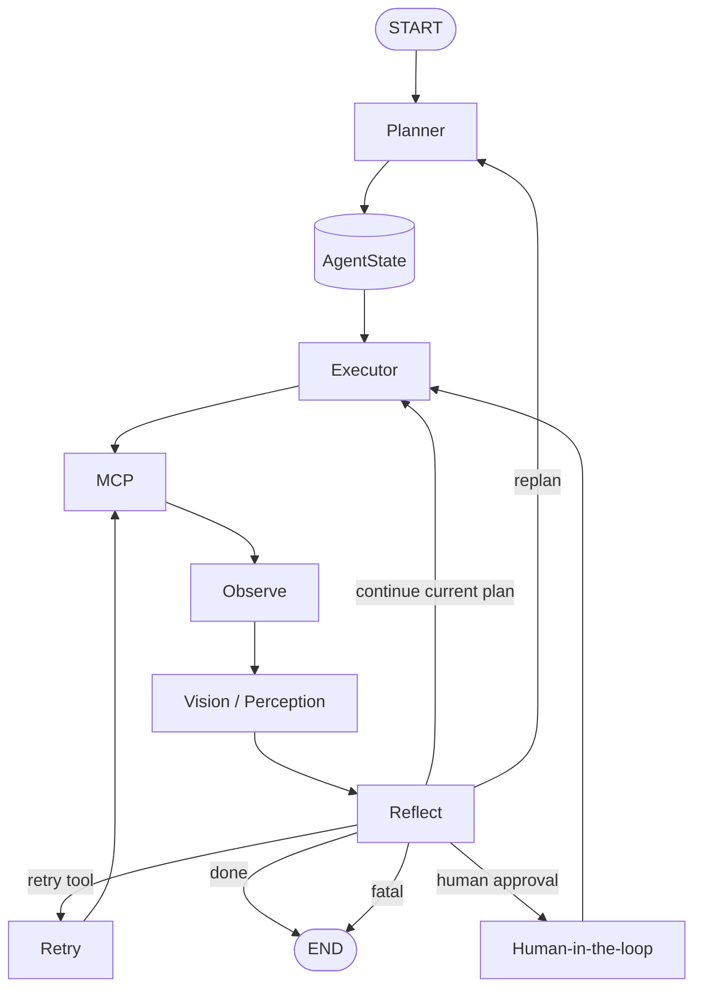
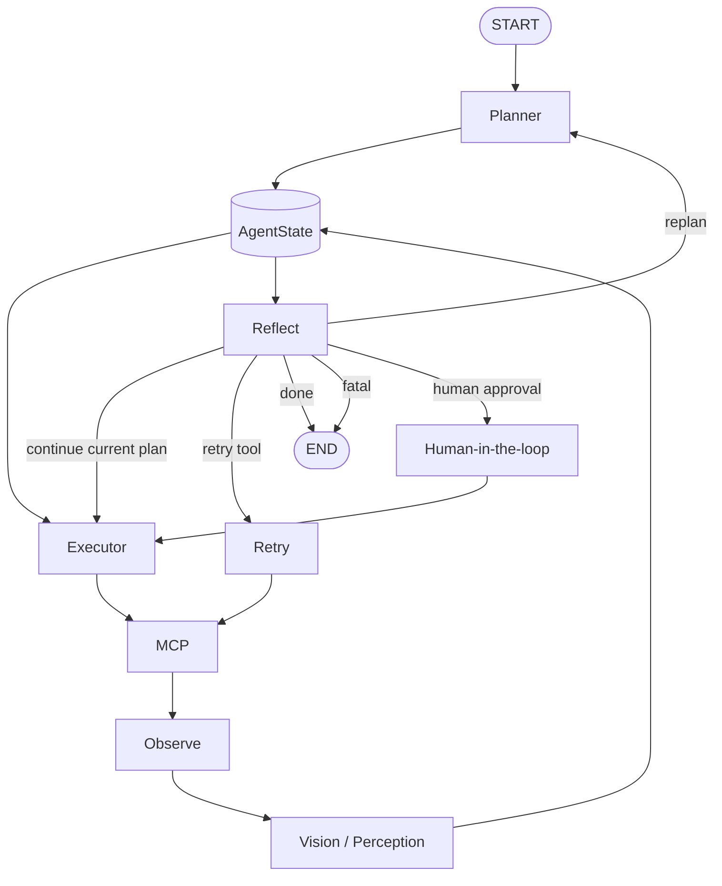

# Графы агента AutoBrowser

## Текущий граф (фаза 2 — done)

```mermaid
flowchart TD

    START([START])

    START --> Planner

    Planner --> State[(AgentState)]

    State --> Executor

    Executor --> MCP

    MCP --> Observe

    Observe --> Vision[Vision / Perception]

    Vision --> Reflect

    Reflect -->|continue current plan| Executor

    Reflect -->|replan| Planner

    Reflect -->|retry tool| Retry

    Retry --> MCP

    Reflect -->|done| END([END])

    Reflect -->|fatal| END

    Reflect -->|human approval| Human[Human-in-the-loop]

    Human --> Executor
```

## Целевой граф (фаза 2 — pending)

```mermaid
flowchart TD

    START([START])

    START --> Planner

    Planner --> State[(AgentState)]

    State --> Executor

    Executor --> MCP

    MCP --> Observe

    Observe --> Vision[Vision / Perception]

    Vision --> State

    State --> Reflect

    Reflect -->|continue current plan| Executor

    Reflect -->|replan| Planner

    Reflect -->|retry tool| Retry

    Retry --> MCP

    Reflect -->|done| END([END])

    Reflect -->|fatal| END

    Reflect -->|human approval| Human[Human-in-the-loop]

    Human --> Executor
```
