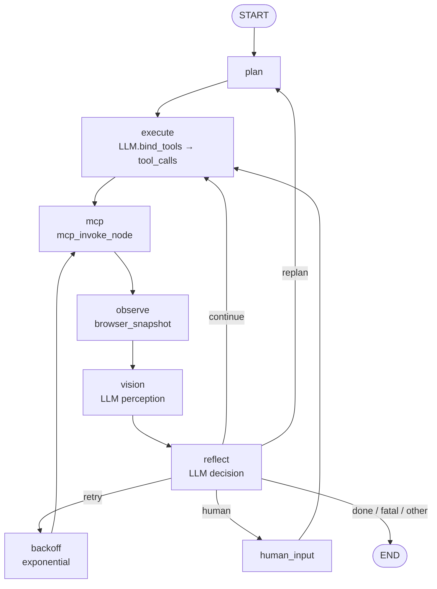

# Графы агента AutoBrowser

## Текущий граф (реализован)

## Известные проблемы

- `reflect_node` временно использует `ainvoke` без structured output — рефлексия всегда заканчивается в END
- Продвижение шагов (`plan_steps[0]` → удалить после выполнения) не реализовано
